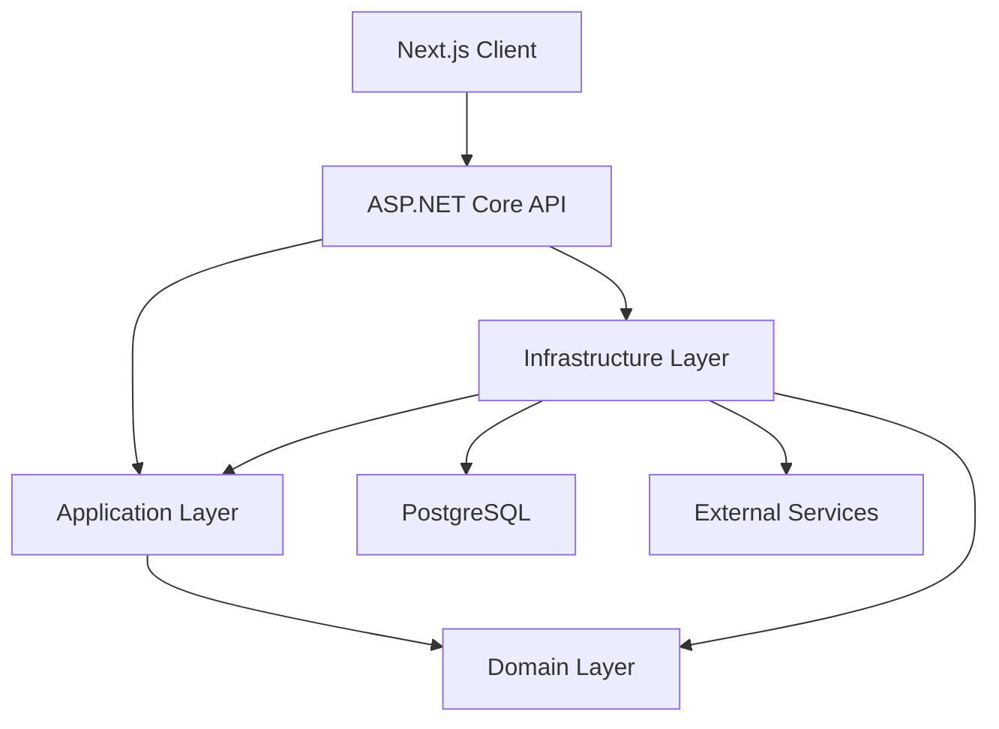
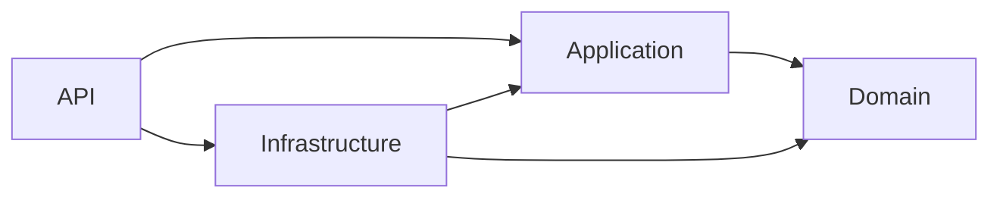
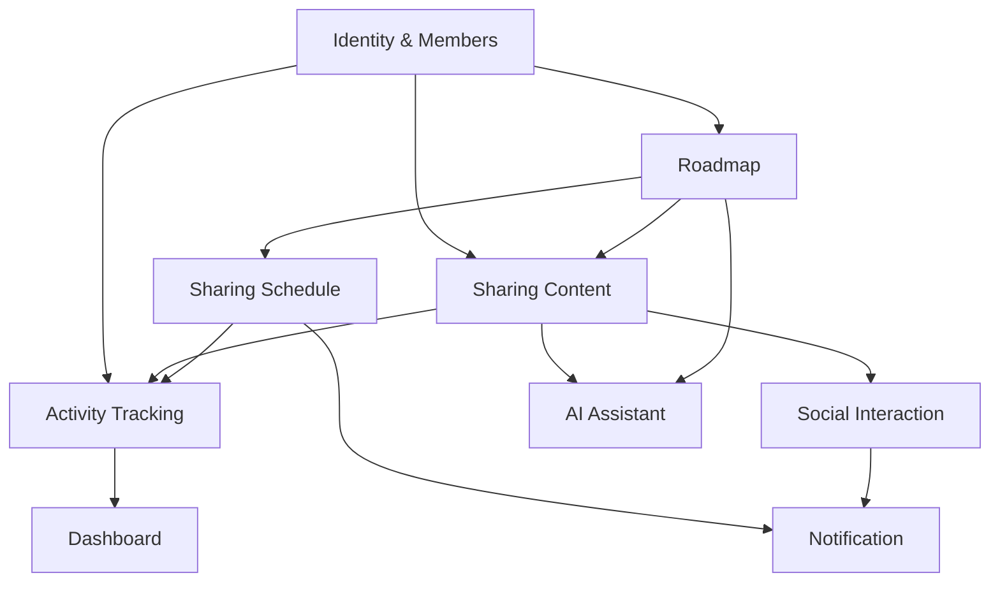
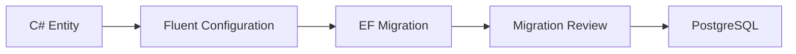
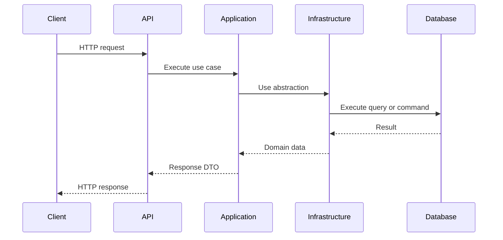
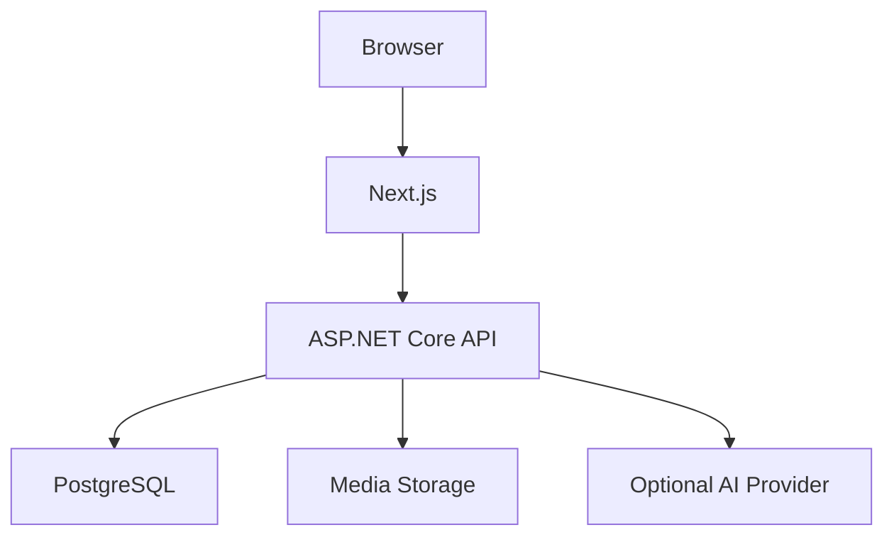

# GDSC Sharing Platform Architecture

## 1. Document purpose

This document describes the architecture of the GDSC Sharing Platform,
including:

- System boundaries
- Solution structure
- Dependency rules
- Domain modules
- Database architecture
- Authentication and authorization
- Cross-cutting concerns
- Deployment direction
- Architectural decisions

This document represents the target architecture. Features are implemented
incrementally by sprint.

## 2. System overview

GDSC Sharing Platform enables club members to store, organize, present, and
discuss knowledge from internal sharing sessions.

Administrators can:

- Manage members and departments
- Assign and revoke roles
- Create learning roadmaps
- Create roadmap nodes
- Assign presenters
- Manage sharing schedules
- Moderate content
- View contribution statistics

Members can:

- Browse learning roadmaps
- View assigned roadmap nodes
- Write sharing content
- Attach learning resources
- Publish or submit content
- Like and comment
- Join sharing schedules
- Receive notifications
- Use optional AI assistance

## 3. Architecture style

The backend uses a modular monolith with layered dependency rules.



A modular monolith is selected because:

- The MVP has one product and one development team.
- Business transactions span multiple modules.
- Deployment is simpler than microservices.
- Operational overhead remains low.
- Modules can be extracted later if justified.

Microservices are not part of the MVP.

## 4. Solution architecture

```text
GdscSharingPlatform.sln
├── src
│   ├── GdscSharing.Api
│   ├── GdscSharing.Application
│   ├── GdscSharing.Domain
│   └── GdscSharing.Infrastructure
└── tests
    ├── GdscSharing.UnitTests
    └── GdscSharing.IntegrationTests
```

### 4.1. Domain layer

Responsibilities:

- Core business entities
- Business enums
- Value objects
- Domain rules
- Business state transitions

Examples:

```text
Department
Roadmap
RoadmapNode
RoadmapAssignment
SharingPost
SharingSchedule
Comment
Notification
```

The Domain layer must remain independent from:

- EF Core
- PostgreSQL
- ASP.NET Core
- Identity
- HTTP
- External AI providers

### 4.2. Application layer

Responsibilities:

- Use-case orchestration
- Commands and queries
- DTOs
- Validation
- Authorization requirements
- Service abstractions
- Transaction boundaries at use-case level

Examples:

```text
CreateRoadmapCommand
AssignRoadmapMemberCommand
PublishSharingPostCommand
GetMonthlyDashboardQuery
IAiAssistant
ICurrentUser
IApplicationDbContext
```

Application describes what the system needs but does not know the concrete
technical implementation.

### 4.3. Infrastructure layer

Responsibilities:

- EF Core
- PostgreSQL
- ASP.NET Core Identity
- Database migrations
- Database seeding
- External APIs
- File storage
- AI provider implementation
- Notification delivery implementation

Examples:

```text
ApplicationDbContext
ApplicationUser
DepartmentConfiguration
DatabaseSeeder
AiAssistantService
```

### 4.4. API layer

Responsibilities:

- HTTP endpoints
- Request binding
- Authentication configuration
- Authorization policies
- Error handling
- OpenAPI
- Middleware pipeline
- Dependency registration
- Application startup

The API layer should not contain business rules.

## 5. Dependency direction



The dependency direction points inward toward business logic.

Infrastructure implements interfaces defined by Application.

Example:

```csharp
// Application
public interface IAiAssistant
{
    Task<string> SummarizeAsync(
        string content,
        CancellationToken cancellationToken);
}
```

```csharp
// Infrastructure
public sealed class AiAssistantService : IAiAssistant
{
    // Provider-specific implementation
}
```

## 6. Frontend architecture

The frontend is a separate Next.js application.

```text
frontend
├── src
│   ├── app
│   ├── components
│   ├── features
│   ├── lib
│   ├── services
│   └── types
└── package.json
```

Responsibilities:

- Present UI
- Manage client-side state
- Call backend APIs
- Render sanitized sharing content
- Enforce usability-level route guards

The frontend must not be treated as the security boundary. Every permission
must be enforced again in the API.

## 7. Domain modules

The system is divided into logical modules inside one deployable backend.



### 7.1. Identity and Members

Responsibilities:

- User accounts
- Password management
- Roles
- User statuses
- Departments
- Member profiles
- Refresh tokens
- Account locking
- Soft deletion

Initial roles:

```text
Admin
Member
```

A user may have both roles.

### 7.2. Roadmap

Responsibilities:

- Knowledge areas
- Roadmaps
- Hierarchical roadmap nodes
- Node prerequisites
- Assignments
- Deadlines
- Learning resources
- Completion state

Roadmap nodes use a self-referencing relationship:

```text
RoadmapNode
├── ParentId
├── Children
└── RoadmapId
```

Rules:

- A node and its parent must belong to the same roadmap.
- A node cannot be its own parent.
- Cycles are forbidden.
- MVP display depth is limited to four levels.
- Only authorized Admin users can mark final completion.

### 7.3. Sharing Content

Responsibilities:

- Draft content
- Submission
- Publishing
- Archiving
- Rich-text content
- Revision history
- Resource URLs
- Media
- Tags

Content is linked to a roadmap node but remains one source of truth.

The same published post can appear in:

- Home feed
- Roadmap node
- Member profile
- Search results

Rich-text content stores:

```text
ContentJson
SanitizedHtml
```

Raw, untrusted HTML must never be rendered.

### 7.4. Sharing Schedule

Responsibilities:

- Session scheduling
- Presenters
- Attendance
- Online/offline location
- Publishing and cancellation
- Completion
- Schedule notifications

Time rules:

```text
StartAt < EndAt
```

All persisted timestamps use UTC.

### 7.5. Social Interaction

Responsibilities:

- Likes
- Comments
- Replies
- Bookmarks
- Content reports

A database unique constraint protects likes:

```text
(PostId, UserId)
```

This protects the system even when concurrent requests pass application-level
validation at the same time.

### 7.6. Notification

Responsibilities:

- In-app notifications
- Unread count
- Mark as read
- Entity links
- Notification metadata

Initial implementation uses polling.

SignalR may be added later without changing the notification data model.

### 7.7. Dashboard

Dashboard is initially query-based and does not require dedicated aggregate
tables.

Initial monthly contribution formula:

```text
10 × Published posts
+ 6 × Completed sharing sessions
+ 2 × Valid comments
+ 1 × Likes received
```

Aggregate tables or background jobs are introduced only when query
performance requires them.

### 7.8. AI Assistant

AI is optional and must not block core platform workflows.

Possible features:

- Suggest a title
- Generate an outline
- Summarize a post
- Generate review questions
- Suggest tags
- Review missing content

The Application layer defines a provider-independent interface.

Provider API keys belong to Infrastructure configuration and secret storage.

RAG and vector databases are outside the initial MVP.

## 8. Identity architecture

The system uses ASP.NET Core Identity with `Guid` keys.

```csharp
public class ApplicationUser
    : IdentityUser<Guid>
{
}
```

```csharp
IdentityRole<Guid>
```

```csharp
IdentityDbContext<
    ApplicationUser,
    IdentityRole<Guid>,
    Guid>
```

Identity creates:

```text
AspNetUsers
AspNetRoles
AspNetUserRoles
AspNetUserClaims
AspNetRoleClaims
AspNetUserLogins
AspNetUserTokens
```

Application-specific user fields include:

```text
FullName
DisplayName
AvatarUrl
Bio
DepartmentId
Status
JoinedAt
LastLoginAt
LastActiveAt
TimeZone
Locale
IsDeleted
CreatedAt
UpdatedAt
DeletedAt
```

## 9. Authorization architecture

The system uses multiple authorization levels.

### 9.1. Role-based authorization

Examples:

```text
Admin-only user management
Admin-only roadmap management
Member sharing capabilities
```

### 9.2. Policy-based authorization

Examples:

```text
ActiveUser
AdminOnly
MemberOrAdmin
CanManageRoadmap
```

### 9.3. Resource-based authorization

Examples:

```text
Post author may edit their own draft.
Admin may moderate any post.
Assigned member may create content for an assigned node.
User may delete their own comment.
```

Role checks alone are insufficient for ownership-based operations.

## 10. Database architecture

Primary database:

```text
PostgreSQL
```

Access technology:

```text
Entity Framework Core + Npgsql
```

Database workflow:



### 10.1. Identifier strategy

Business entities use:

```text
uuid / Guid
```

Benefits:

- Consistent foreign keys
- IDs can be generated in the application
- Lower risk of exposing sequential record counts

### 10.2. Time strategy

Application:

```csharp
DateTimeOffset.UtcNow
```

PostgreSQL:

```text
timestamptz
```

Presentation:

```text
Asia/Ho_Chi_Minh
```

### 10.3. Deletion strategy

Soft delete:

```text
ApplicationUser
Department
Roadmap
RoadmapNode
SharingPost
Comment
SharingSchedule
```

Physical cascade deletion may be used for dependent records without independent
business meaning:

```text
PostRevision
PostResource
PostTag
PostLike
ScheduleAttendance
```

### 10.4. Migration strategy

Migrations are introduced incrementally:

```text
InitialIdentity
AddAuthentication
AddRoadmap
AddSharingContent
AddSocialInteraction
AddSharingSchedule
AddAiAssistant
```

The initial migration contains only:

```text
Identity tables
Departments
```

## 11. Database initialization and seeding

Startup initialization order:

```text
Apply migration
→ Seed roles
→ Seed departments
→ Seed bootstrap Admin
```

Initial roles:

```text
Admin
Member
```

Default departments:

```text
MANAGEMENT
SOFTWARE
DESIGN
PHOTOGRAPHY
MEDIA
```

Seeder requirements:

- Idempotent
- No duplicate records
- No password reset for existing Admin
- Password obtained from configuration secrets
- Bootstrap Admin receives both roles
- Sensitive values are never logged

For local development:

```text
.NET User Secrets
```

For production:

```text
Environment variables or secret manager
```

## 12. Request flow

Typical command request:



The API maps transport data. Application coordinates the use case.
Infrastructure performs technical operations.

## 13. Dependency Injection

Dependencies are registered by layer.

API startup:

```csharp
builder.Services.AddApplication();
builder.Services.AddInfrastructure(
    builder.Configuration);
```

`ApplicationDbContext` uses Scoped lifetime.

```text
One HTTP request
→ One DbContext
→ One unit of work
```

DbContext must not be Singleton because it is not thread-safe.

## 14. Error handling

The API uses centralized exception handling and ProblemDetails.

Expected response shape:

```json
{
  "type": "https://example.com/errors/not-found",
  "title": "Resource not found",
  "status": 404,
  "detail": "The requested resource was not found.",
  "traceId": "..."
}
```

The API must not expose:

- Stack traces in production
- Database credentials
- SQL connection details
- Token values
- Internal implementation secrets

## 15. Logging and observability

Logging uses structured properties.

```csharp
_logger.LogInformation(
    "Published post {PostId} by user {UserId}.",
    postId,
    userId);
```

Initial observability:

- Structured application logs
- HTTP trace ID
- Database error correlation
- Health checks
- Startup migration logs

Future observability may include:

- Metrics
- Distributed tracing
- External log aggregation
- Performance monitoring

## 16. Health checks

The API exposes a health endpoint:

```text
GET /health
```

It should verify:

- API process is running
- PostgreSQL is reachable

External AI provider health should not make the entire core API unhealthy
unless AI is a mandatory dependency.

## 17. Security architecture

Security controls include:

- Identity password hashing
- Account lockout
- Unique email
- JWT access tokens
- Refresh-token rotation
- Hashed refresh-token storage
- Role and policy authorization
- Resource ownership checks
- Rate limiting
- CORS configuration
- Rich-text sanitization
- Resource URL validation
- Secret management
- Audit logging

Secrets must never be committed to Git.

## 18. Deployment architecture

Initial deployment:



Development uses Docker Compose for:

- PostgreSQL
- API
- Frontend

Production migration should eventually run as a deployment step before
starting multiple API instances.

## 19. Testing architecture

### Unit tests

Target:

- Domain rules
- Validation
- State transitions
- Authorization decisions
- Dashboard calculation
- Idempotency logic

### Integration tests

Target:

- API endpoints
- Identity behavior
- PostgreSQL constraints
- EF Core mappings
- Migration execution
- Seeder execution
- ProblemDetails
- Health checks

A real PostgreSQL test container is preferred when provider-specific behavior
matters.

## 20. Sprint-based implementation

### Sprint 0 — Foundation

- Solution structure
- EF Core and PostgreSQL
- Identity
- ApplicationUser
- Department
- Initial migration
- Role and Admin seeding
- ProblemDetails
- Logging
- OpenAPI
- Health check
- Docker
- Next.js foundation
- Smoke and integration tests

### Sprint 1 — Authentication and Users

- Login
- Access token
- Refresh token
- Logout
- User management
- Role management
- Account status
- Profile
- Audit events

### Sprint 2 — Roadmap

- Knowledge areas
- Roadmaps
- Hierarchical nodes
- Assignments
- Deadlines
- Resources

### Sprint 3 — Sharing Content

- Draft
- Submission
- Publishing
- Rich text
- Revisions
- Media and resources
- Feed and search

### Sprint 4 — Social and Notifications

- Likes
- Comments
- Replies
- Bookmarks
- Notifications
- Content reports

### Sprint 5 — Schedule and Dashboard

- Sharing schedules
- Presenters
- Attendance
- Monthly dashboard
- Contribution leaderboard

### Sprint 6 — Hardening and Optional AI

- AI assistance
- Rate limiting
- Security review
- Performance review
- End-to-end tests
- CI/CD
- Staging deployment

## 21. Architectural decisions

### ADR-001: Modular monolith

Selected over microservices because the MVP benefits from simple deployment
and transactional consistency.

### ADR-002: PostgreSQL

Selected for relational integrity, indexing, JSONB, open-source availability,
and strong EF Core support through Npgsql.

### ADR-003: ASP.NET Core Identity

Selected to avoid implementing password hashing, role storage, account
lockout, and token infrastructure manually.

### ADR-004: Guid identifiers

Selected to keep identifiers consistent across Identity and business entities.

### ADR-005: Runtime bootstrap seeding

Roles, departments, and the initial Admin are seeded at runtime because the
Admin password must be processed by `UserManager` and must not exist in source
code.

### ADR-006: Query-based dashboard first

Dashboard values are calculated from source tables during MVP. Aggregate
tables are introduced only after performance evidence justifies them.

### ADR-007: AI as an optional integration

Core workflows remain usable when the AI provider is unavailable.

## 22. Architecture change process

When making an architectural change:

1. Explain the current limitation.
2. Describe the proposed change.
3. Identify affected layers and modules.
4. Document trade-offs.
5. Update this file.
6. Add an ADR when the decision is significant.
7. Add or update tests.
8. Verify dependency direction.
