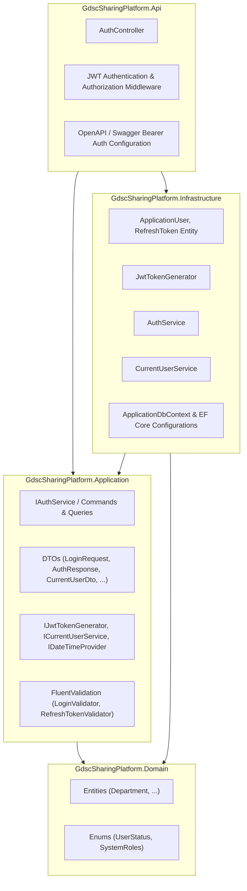
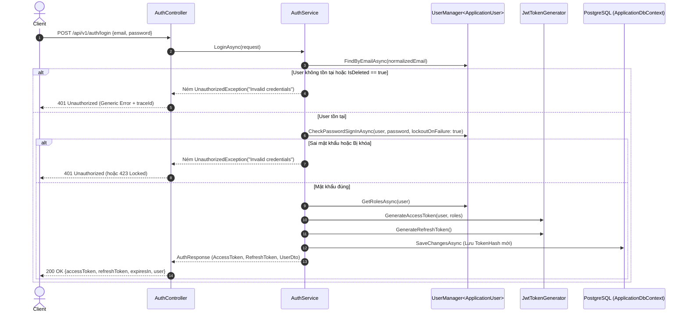
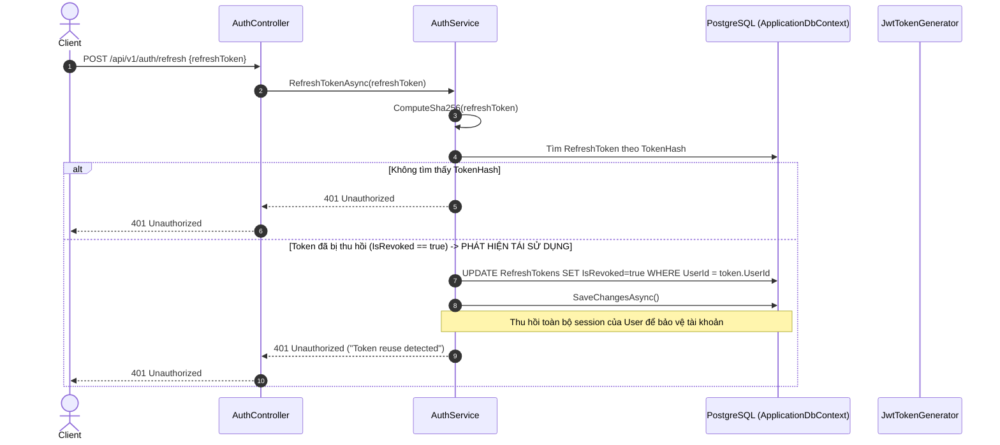

# Implementation Plan: Authentication and Authorization (Sprint 1)

**Feature**: `001-authentication-authorization`  
**Feature Spec**: [spec.md](file:///Users/nguyenhongson/Documents/GDG/gdsc-sharing-platform/docs/features/auth/spec.md)  
**Created**: 2026-08-25  
**Status**: Ready for Implementation  
**Target Milestone**: Sprint 1 — Baseline Authentication & Authorization

---

## 1. Tổng quan mục tiêu (Goal Overview)

Xây dựng hoàn chỉnh hệ thống xác thực (Authentication) và phân quyền (Authorization) cốt lõi cho **GDSC Sharing Platform** theo kiến trúc Clean Architecture trên nền tảng .NET 10, ASP.NET Core Identity, PostgreSQL và JWT (JSON Web Tokens).

### Các năng lực chính được bàn giao trong Sprint 1:

1. **Đăng nhập (Login)**: Xác thực email/mật khẩu không phân biệt hoa thường, trả về Access Token (JWT) ngắn hạn (15 phút) và Refresh Token dài hạn (7 ngày).
2. **Làm mới phiên (Token Refresh & Rotation)**: Cấp mới cặp Access Token và Refresh Token, vô hiệu hóa Refresh Token cũ, phát hiện và ngăn chặn tấn công tái sử dụng token (Token Reuse Detection).
3. **Xem thông tin tài khoản hiện tại (Current User Profile)**: Endpoint `/api/v1/auth/me` trả về thông tin định danh, email, họ tên, phòng ban (Department) và danh sách roles (`Admin`, `Member`).
4. **Đăng xuất (Logout & Logout All)**: Thu hồi Refresh Token của phiên hiện tại hoặc toàn bộ phiên đang hoạt động của người dùng trên mọi thiết bị.
5. **Phân quyền Role-based & Policy-based**: Bảo vệ các endpoint dựa trên vai trò `Admin`, `Member` và trạng thái hoạt động của tài khoản (`UserStatus.Active`).
6. **Bảo mật và Giám sát**: Không lưu Refresh Token dạng plain text (băm SHA-256 trước khi lưu DB), nhất quán thông báo lỗi đăng nhập (chống User Enumeration), tích hợp `traceId` và chuẩn hóa RFC 7807 Problem Details.

---

## 2. Kiến trúc kỹ thuật & Nguyên tắc thiết kế (Technical Architecture)

Hệ thống tuân thủ nghiêm ngặt mô hình **Clean Architecture / Onion Architecture** và các nguyên tắc đã thống nhất trong [docs/ARCHITECTURE.md](file:///Users/nguyenhongson/Documents/GDG/gdsc-sharing-platform/docs/ARCHITECTURE.md):



### 2.1. Phân bổ trách nhiệm theo Layer

| Layer              | Project                              | Trách nhiệm trong Sprint 1                                                                                                                                                                                                                       |
| ------------------ | ------------------------------------ | ------------------------------------------------------------------------------------------------------------------------------------------------------------------------------------------------------------------------------------------------ |
| **Domain**         | `GdscSharingPlatform.Domain`         | Chứa các hằng số, Enum trạng thái (`UserStatus`), hằng số Roles (`RoleNames.Admin`, `RoleNames.Member`), Domain Exceptions nếu có.                                                                                                               |
| **Application**    | `GdscSharingPlatform.Application`    | Interface trừu tượng (`IJwtTokenGenerator`, `IAuthService`, `ICurrentUserService`, `IApplicationDbContext`), DTOs (Request/Response contracts), FluentValidation rules, Custom Exceptions (`UnauthorizedException`, `ForbiddenAccessException`). |
| **Infrastructure** | `GdscSharingPlatform.Infrastructure` | Entity `RefreshToken`, EF Core Configuration cho `RefreshToken`, triển khai `JwtTokenGenerator`, `AuthService`, `CurrentUserService`, tích hợp `UserManager<ApplicationUser>`, PasswordHasher, database migrations.                              |
| **API**            | `GdscSharingPlatform.Api`            | `AuthController` (`/api/v1/auth/...`), cấu hình `AddAuthentication(JwtBearerDefaults.AuthenticationScheme)`, cấu hình Authorization Policies, Swagger Bearer Security Definition.                                                                |
| **Tests**          | `UnitTests` & `IntegrationTests`     | Kiểm thử độc lập từng thành phần và kiểm thử end-to-end API với PostgreSQL thật trong container test.                                                                                                                                            |

---

## 3. Thiết kế Dữ liệu & Database Migration (Data Model & Schema)

### 3.1. Entity `RefreshToken`

Tạo mới entity `RefreshToken` thuộc quản lý của Identity/Infrastructure:

```csharp
namespace GdscSharingPlatform.Infrastructure.Identity;

public class RefreshToken
{
    public Guid Id { get; set; } = Guid.NewGuid();

    public Guid UserId { get; set; }
    public ApplicationUser User { get; set; } = null!;

    /// <summary>
    /// Giá trị băm SHA-256 của Refresh Token thô gửi cho client.
    /// Không bao giờ lưu plain text token trong database (SR-003).
    /// </summary>
    public string TokenHash { get; set; } = string.Empty;

    public DateTimeOffset CreatedAt { get; set; } = DateTimeOffset.UtcNow;
    public DateTimeOffset ExpiresAt { get; set; }

    public bool IsRevoked { get; set; }
    public DateTimeOffset? RevokedAt { get; set; }
    public string? ReplacedByTokenHash { get; set; }
    public string? RevocationReason { get; set; }

    public string? CreatedByIp { get; set; }
    public string? UserAgent { get; set; }

    public bool IsExpired => DateTimeOffset.UtcNow >= ExpiresAt;
    public bool IsActive => !IsRevoked && !IsExpired;
}
```

### 3.2. Mối quan hệ với `ApplicationUser`

- `ApplicationUser` có quan hệ 1 - N với `RefreshToken` (`public ICollection<RefreshToken> RefreshTokens { get; set; }`).
- Cấu hình Fluent API:
  - Bảng: `RefreshTokens` (hoặc `AspNetRefreshTokens`).
  - Khóa chính: `Id` (`Guid`).
  - Index: `TokenHash` (Unique index để tra cứu `O(1)`).
  - Index: `(UserId, IsRevoked, ExpiresAt)` để tối ưu hóa truy vấn các token đang hoạt động khi đăng xuất toàn bộ thiết bị.
  - Foreign key: `UserId` liên kết `AspNetUsers(Id)`, `OnDelete: Cascade`.

### 3.3. EF Core Migration

- Tạo migration: `AddRefreshTokenTable`.
- Đảm bảo migration tương thích ngược, bảo toàn 100% tài khoản Admin đã seed và Department từ Sprint 0.

---

## 4. Đặc tả Cấu hình & Bảo mật (Configuration & Security Specs)

### 4.1. Cấu hình JWT (`appsettings.json` / Environment Variables)

```json
{
  "Jwt": {
    "Issuer": "GdscSharingPlatform",
    "Audience": "GdscSharingPlatformClient",
    "SecretKey": "GDSC_SHARING_PLATFORM_SUPER_SECRET_KEY_MIN_32_BYTES_LONG_FOR_HMAC_SHA256",
    "AccessTokenExpirationMinutes": 15,
    "RefreshTokenExpirationDays": 7,
    "ClockSkewSeconds": 0
  }
}
```

> [!IMPORTANT]
> **Quy tắc bảo mật bắt buộc:**
>
> 1. `SecretKey` phải có độ dài tối thiểu 256-bit (32 ký tự). Hệ thống phải kiểm tra `ValidateOnStart()` lúc khởi động (FR-042). Nếu thiếu secret hoặc độ dài không đạt, ứng dụng lập tức báo lỗi và dừng khởi động.
> 2. Mọi mốc thời gian phát hành (`iat`), hết hạn (`exp`), thu hồi (`RevokedAt`) đều được tính theo chuẩn **UTC** (`DateTimeOffset.UtcNow`) (FR-049).
> 3. `ClockSkew` được thiết lập chặt chẽ (`TimeSpan.Zero` hoặc tối đa 5 giây) để tránh việc token hết hạn vẫn được chấp nhận.

### 4.2. Cấu trúc Claims trong Access Token (JWT Payload)

| Claim Type                 | Giá trị                         | Mục đích                                           |
| -------------------------- | ------------------------------- | -------------------------------------------------- |
| `sub` / `NameIdentifier`   | `user.Id.ToString()`            | Định danh người dùng duy nhất                      |
| `email`                    | `user.Email`                    | Email người dùng                                   |
| `name` / `given_name`      | `user.FullName`                 | Họ và tên                                          |
| `role`                     | `Admin`, `Member` (mảng)        | Danh sách vai trò để ASP.NET Core kiểm tra quyền   |
| `department_id`            | `user.DepartmentId?.ToString()` | Định danh phòng ban                                |
| `status`                   | `user.Status.ToString()`        | Trạng thái tài khoản (`Active`)                    |
| `jti`                      | `Guid.NewGuid().ToString()`     | Định danh duy nhất của access token                |
| `iss`, `aud`, `exp`, `nbf` | Chuẩn JWT                       | Nguồn phát hành, đối tượng sử dụng, thời gian sống |

---

## 5. Đặc tả API Endpoints & Request/Response Contracts

Tất cả endpoint được đặt prefix theo chuẩn `/api/v1/auth`.

```text
POST   /api/v1/auth/login        -> Đăng nhập bằng Email & Password
POST   /api/v1/auth/refresh      -> Làm mới Access Token bằng Refresh Token (Token Rotation)
POST   /api/v1/auth/logout       -> Đăng xuất phiên hiện tại (Thu hồi Refresh Token hiện tại)
POST   /api/v1/auth/logout-all   -> Đăng xuất tất cả thiết bị (Thu hồi toàn bộ Refresh Tokens)
GET    /api/v1/auth/me           -> Lấy thông tin tài khoản hiện tại (Yêu cầu Bearer Token)
GET    /api/v1/auth/test/member  -> Endpoint kiểm thử quyền Member (FR-045)
GET    /api/v1/auth/test/admin   -> Endpoint kiểm thử quyền Admin (FR-045)
```

---

### 5.1. `POST /api/v1/auth/login`

- **Mô tả**: Xác thực người dùng bằng email và mật khẩu, cấp cặp token mới.
- **Yêu cầu phân quyền**: Public (Không yêu cầu xác thực).

#### Request Body:

```json
{
  "email": "admin@gdsc.dev",
  "password": "Password123!"
}
```

#### Validation Rules:

- `email`: Bắt buộc, đúng định dạng email, tự động trim và lowercase khi tìm kiếm user, độ dài <= 256 ký tự.
- `password`: Bắt buộc, không được trim khoảng trắng (FR-003), độ dài <= 128 ký tự.

#### Response:

- **200 OK**:

```json
{
  "accessToken": "eyJhbGciOiJIUzI1NiIs...",
  "refreshToken": "dGhpcy1pcy1hLXJhbmRvbS1yZWZyZXNoLXRva2Vu...",
  "tokenType": "Bearer",
  "expiresIn": 900,
  "user": {
    "id": "3fa85f64-5717-4562-b3fc-2c963f66afa6",
    "email": "admin@gdsc.dev",
    "fullName": "System Administrator",
    "displayName": "Admin",
    "status": "Active",
    "roles": ["Admin"],
    "department": {
      "id": "7ca85f64-5717-4562-b3fc-2c963f66afa1",
      "code": "CORE",
      "name": "Core Team"
    }
  }
}
```

- **400 Bad Request**: Lỗi validation các trường (RFC 7807 ValidationProblemDetails).
- **401 Unauthorized**: Sai email hoặc sai password hoặc tài khoản không ở trạng thái `Active`.
  ```json
  {
    "type": "https://tools.ietf.org/html/rfc7235#section-3.1",
    "title": "Unauthorized",
    "status": 401,
    "detail": "Invalid email or password.",
    "traceId": "0HN05G8..."
  }
  ```
  _(Tuyệt đối không tiết lộ tài khoản có tồn tại hay không - FR-004, SR-008)._
- **423 Locked / 401**: Tài khoản bị khóa do vượt quá số lần thử sai (`LockoutEnabled`).

---

### 5.2. `POST /api/v1/auth/refresh`

- **Mô tả**: Sử dụng Refresh Token thô để nhận cặp Access Token và Refresh Token mới (Rotation).
- **Yêu cầu phân quyền**: Public.

#### Request Body:

```json
{
  "refreshToken": "dGhpcy1pcy1hLXJhbmRvbS1yZWZyZXNoLXRva2Vu..."
}
```

#### Xử lý nghiệp vụ & Token Rotation:

1. Client gửi `refreshToken`.
2. Hệ thống tính hash SHA-256 của chuỗi token nhận được.
3. Tìm bản ghi `RefreshToken` trong DB theo `TokenHash`.
4. **Phát hiện tái sử dụng (Reuse Detection)**:
   - Nếu tìm thấy token nhưng token đã bị `IsRevoked == true` hoặc đã có `ReplacedByTokenHash`:
     - **CẢNH BÁO BẢO MẬT (Security Event)**: Đã có hành vi sử dụng lại token đã bị thay thế (FR-017, FR-018, SR-012).
     - Thu hồi NGAY LẬP TỨC toàn bộ Refresh Tokens của User sở hữu (`IsRevoked = true`, `RevocationReason = "Token reuse detected"`).
     - Ghi audit log cảnh báo với `traceId`.
     - Trả về **401 Unauthorized** ("Invalid refresh token.").
5. Nếu token không tồn tại, hết hạn (`IsExpired`), hoặc User bị vô hiệu hóa/bị xóa -> Trả về **401 Unauthorized**.
6. Nếu hợp lệ:
   - Tạo cặp token mới: `newAccessToken`, `newRefreshTokenRaw`.
   - Băm SHA-256 `newRefreshTokenRaw` -> `newRefreshTokenHash`.
   - Cập nhật token cũ: `IsRevoked = true`, `RevokedAt = UtcNow`, `ReplacedByTokenHash = newRefreshTokenHash`, `RevocationReason = "Rotated"`.
   - Tạo bản ghi mới cho `newRefreshTokenHash`.
   - Lưu DB trong một transaction an toàn.
   - Trả về kết quả cho client.

#### Response:

- **200 OK**:

```json
{
  "accessToken": "eyJhbGciOiJIUzI1NiIs...",
  "refreshToken": "bmV3LXJhbmRvbS1yZWZyZXNoLXRva2Vu...",
  "tokenType": "Bearer",
  "expiresIn": 900
}
```

- **401 Unauthorized**: Refresh token không hợp lệ, đã hết hạn hoặc bị thu hồi.

---

### 5.3. `POST /api/v1/auth/logout`

- **Mô tả**: Đăng xuất phiên hiện tại. Thu hồi duy nhất Refresh Token được gửi lên.
- **Yêu cầu phân quyền**: Yêu cầu đã đăng nhập (Authorize Bearer) hoặc gửi kèm `refreshToken` trong body.

#### Request Body:

```json
{
  "refreshToken": "dGhpcy1pcy1hLXJhbmRvbS1yZWZyZXNoLXRva2Vu..."
}
```

#### Response:

- **200 OK** (hoặc **204 No Content**):

```json
{
  "message": "Logged out successfully."
}
```

- **Lưu ý**: Xử lý Idempotent (FR-022) — Nếu gửi lại cùng một token đã thu hồi trước đó, hệ thống xử lý an toàn và trả về thành công, không phát sinh lỗi dữ liệu.

---

### 5.4. `POST /api/v1/auth/logout-all`

- **Mô tả**: Thu hồi toàn bộ Refresh Tokens còn hiệu lực của người dùng hiện tại trên mọi thiết bị.
- **Yêu cầu phân quyền**: Bắt buộc có Access Token hợp lệ (Bearer Token).

#### Response:

- **200 OK** (hoặc **204 No Content**):

```json
{
  "message": "All active sessions have been revoked."
}
```

---

### 5.5. `GET /api/v1/auth/me`

- **Mô tả**: Lấy thông tin tài khoản của phiên đăng nhập hiện tại từ Claims và DB.
- **Yêu cầu phân quyền**: Bắt buộc có Access Token hợp lệ (Bearer Token).

#### Response:

- **200 OK**:

```json
{
  "id": "3fa85f64-5717-4562-b3fc-2c963f66afa6",
  "email": "member@gdsc.dev",
  "fullName": "Nguyen Van A",
  "displayName": "Alex",
  "avatarUrl": "https://example.com/avatar.png",
  "bio": "Software Engineering enthusiast",
  "status": "Active",
  "timeZone": "Asia/Ho_Chi_Minh",
  "locale": "vi-VN",
  "roles": ["Member"],
  "department": {
    "id": "7ca85f64-5717-4562-b3fc-2c963f66afa1",
    "code": "DEV",
    "name": "Software Development"
  },
  "joinedAt": "2026-08-20T00:00:00Z"
}
```

- **401 Unauthorized**: Khi không có header Authorization hoặc token không hợp lệ/hết hạn.

---

### 5.6. Endpoints kiểm thử quyền độc lập (Independent Verification - FR-045)

- `GET /api/v1/auth/test/member`
  - Policy: `[Authorize(Roles = "Member,Admin")]`
  - Kết quả: `200 OK` nếu có role `Member` hoặc `Admin`; `401 Unauthorized` nếu chưa đăng nhập; `403 Forbidden` nếu không đủ role.
- `GET /api/v1/auth/test/admin`
  - Policy: `[Authorize(Roles = "Admin")]`
  - Kết quả: `200 OK` nếu có role `Admin`; `401 Unauthorized` nếu chưa đăng nhập; `403 Forbidden` nếu chỉ là `Member`.

---

## 6. Sơ đồ Luồng Nghiệp vụ (Sequence Diagrams)

### 6.1. Luồng Đăng nhập (Login Flow)



### 6.2. Luồng Làm mới Token & Phát hiện Tái sử dụng (Refresh Token & Reuse Detection)



---

## 7. Kế hoạch Triển khai theo từng Giai đoạn (Phases & Tasks Breakdown)

### Phase 1: Chuẩn bị Domain, Database Entity & Migration

- [ ] **Task 1.1**: Định nghĩa hằng số hệ thống trong `GdscSharingPlatform.Application/Common/Security/RoleNames.cs` (bổ sung policy names, claim names).
- [ ] **Task 1.2**: Tạo entity `RefreshToken` trong `GdscSharingPlatform.Infrastructure/Identity/RefreshToken.cs`.
- [ ] **Task 1.3**: Cấu hình Fluent API `RefreshTokenConfiguration.cs` và ánh xạ vào `ApplicationDbContext`.
- [ ] **Task 1.4**: Bổ sung `DbSet<RefreshToken> RefreshTokens` vào `ApplicationDbContext` và interface `IApplicationDbContext` (nếu có).
- [ ] **Task 1.5**: Sinh EF Core Migration `AddRefreshTokenTable` và áp dụng kiểm tra đảm bảo dữ liệu Identity từ Sprint 0 không bị ảnh hưởng.

### Phase 2: Core Token Generator & Password/Security Services

- [ ] **Task 2.1**: Tạo model cấu hình `JwtOptions` với các trường `Issuer`, `Audience`, `SecretKey`, `AccessTokenExpirationMinutes`, `RefreshTokenExpirationDays`, `ClockSkewSeconds`.
- [ ] **Task 2.2**: Cấu hình `IOptions<JwtOptions>` với validation bắt buộc lúc khởi động (`ValidateOnStart()`).
- [ ] **Task 2.3**: Tạo interface `IJwtTokenGenerator` trong `Application` và triển khai `JwtTokenGenerator` trong `Infrastructure` (hỗ trợ sinh claims chuẩn, sinh cryptographically secure random refresh token string, băm SHA-256).
- [ ] **Task 2.4**: Tạo interface `ICurrentUserService` trong `Application` và triển khai `CurrentUserService` dựa trên `IHttpContextAccessor`.

### Phase 3: Application Use Cases & Validation Logic

- [ ] **Task 3.1**: Định nghĩa các DTOs trong `GdscSharingPlatform.Application/Features/Auth/Models`:
  - `LoginRequest`, `LoginResponse`, `RefreshTokenRequest`, `RefreshTokenResponse`, `CurrentUserDto`, `DepartmentDto`.
- [ ] **Task 3.2**: Viết bộ validation `FluentValidation`:
  - `LoginRequestValidator` (email hợp lệ, không empty, password không empty, max length).
  - `RefreshTokenRequestValidator` (token không rỗng, max length).
- [ ] **Task 3.3**: Tạo interface và triển khai `IAuthService`:
  - `LoginAsync(LoginRequest request, string? ipAddress, string? userAgent, CancellationToken ct)`
  - `RefreshTokenAsync(string refreshToken, string? ipAddress, string? userAgent, CancellationToken ct)`
  - `LogoutAsync(string refreshToken, Guid? currentUserId, CancellationToken ct)`
  - `LogoutAllAsync(Guid userId, CancellationToken ct)`
  - `GetCurrentUserAsync(Guid userId, CancellationToken ct)`

### Phase 4: API Layer, Authentication Middleware & OpenAPI

- [ ] **Task 4.1**: Cấu hình `builder.Services.AddAuthentication(JwtBearerDefaults.AuthenticationScheme).AddJwtBearer(...)` trong `Program.cs` hoặc extension method `AddApiAuthentication`.
- [ ] **Task 4.2**: Cấu hình Authorization Policies (`AdminOnly`, `MemberOnly`, `ActiveUser`).
- [ ] **Task 4.3**: Cấu hình Swagger / OpenAPI hỗ trợ xác thực JWT Bearer (`SecurityScheme`, `SecurityRequirement`).
- [ ] **Task 4.4**: Tạo `AuthController` với các route:
  - `POST /api/v1/auth/login`
  - `POST /api/v1/auth/refresh`
  - `POST /api/v1/auth/logout`
  - `POST /api/v1/auth/logout-all`
  - `GET /api/v1/auth/me`
  - `GET /api/v1/auth/test/member`
  - `GET /api/v1/auth/test/admin`
- [ ] **Task 4.5**: Kiểm tra xử lý lỗi toàn cục `GlobalExceptionHandler` cho các trường hợp `UnauthorizedException` và `ForbiddenAccessException` đảm bảo trả về RFC 7807 với `traceId`.

### Phase 5: Automated Testing Suite

- [ ] **Task 5.1**: **Unit Tests**:
  - `JwtTokenGeneratorTests`: Kiểm tra sinh token đúng claim, thời gian hết hạn, băm SHA-256.
  - `LoginRequestValidatorTests`, `RefreshTokenRequestValidatorTests`: Kiểm tra các rule validation.
  - `AuthServiceTests`: Mock các dependency để kiểm tra luồng login, refresh, logout, reuse detection.
- [ ] **Task 5.2**: **Integration Tests**:
  - `LoginEndpointTests`: Đăng nhập thành công với admin mặc định; đăng nhập thất bại với sai password/email; kiểm tra generic error.
  - `RefreshTokenEndpointTests`: Luồng refresh thành công; thử refresh bằng token cũ (phát hiện tái sử dụng và thu hồi toàn bộ token).
  - `LogoutEndpointsTests`: Logout một phiên; Logout all phiên; kiểm tra tính idempotent.
  - `CurrentUserEndpointTests`: Xem profile với token hợp lệ, token hết hạn, không có token.
  - `RoleAuthorizationEndpointTests`: Kiểm tra quyền truy cập của Admin và Member trên các endpoint test.

### Phase 6: Tài liệu & Nghiệm thu

- [ ] **Task 6.1**: Cập nhật Swagger / Postman Collection hướng dẫn kiểm thử luồng Auth.
- [ ] **Task 6.2**: Đối chiếu và nghiệm thu toàn bộ 20 tiêu chí thành công (SC-001 -> SC-020).

---

## 8. Ma trận Truy vết Yêu cầu (Requirements Traceability Matrix)

| Yêu cầu Spec                                       | Tiêu chí Nghiệm thu (Success Criteria) | Thành phần phụ trách                                      | Kế hoạch kiểm thử                                                       |
| -------------------------------------------------- | -------------------------------------- | --------------------------------------------------------- | ----------------------------------------------------------------------- |
| **FR-001, FR-002, FR-003, FR-004**                 | SC-001, SC-002, SC-003                 | `AuthService.LoginAsync`, `UserManager`                   | Integration test đăng nhập đúng/sai credentials, kiểm tra response time |
| **FR-005, FR-019**                                 | SC-001                                 | `AuthService.LoginAsync`, `RefreshTokenAsync`             | Unit & Integration test với tài khoản `UserStatus.Suspended`/`Inactive` |
| **FR-006, FR-007, FR-008, FR-009, SR-003**         | SC-001, SC-015                         | `JwtTokenGenerator`, `RefreshToken` entity                | Unit test kiểm tra hash SHA-256, không lưu token thô vào DB             |
| **FR-013, FR-014, FR-015, FR-016**                 | SC-007, SC-008                         | `AuthService.RefreshTokenAsync`                           | Integration test token rotation                                         |
| **FR-017, FR-018, SR-012**                         | SC-009                                 | `AuthService.RefreshTokenAsync`                           | Integration test mô phỏng tấn công Token Reuse                          |
| **FR-020, FR-021, FR-022**                         | SC-010, SC-012                         | `AuthService.LogoutAsync`                                 | Integration test logout đơn phiên và tính idempotent                    |
| **FR-023, FR-024, FR-025**                         | SC-011                                 | `AuthService.LogoutAllAsync`                              | Integration test logout toàn bộ session                                 |
| **FR-026, FR-027, FR-028, FR-029**                 | SC-004, SC-013                         | `AuthService.GetCurrentUserAsync`, `AuthController.GetMe` | Integration test `/api/v1/auth/me`                                      |
| **FR-030, FR-031, FR-032, FR-033, FR-034, FR-045** | SC-004, SC-005, SC-006                 | `AuthController`, Role policies                           | Integration test test endpoints `/test/member`, `/test/admin`           |
| **FR-039, FR-040, FR-041, SR-010**                 | SC-014, SC-015                         | `GlobalExceptionHandler`, Logging                         | Kiểm tra log và response ProblemDetails có `traceId`                    |
| **FR-042, SR-001**                                 | SC-020                                 | `Program.cs`, `JwtOptions`                                | Unit test startup validation với missing secret                         |
| **FR-043, FR-044**                                 | SC-017, SC-019                         | Database Migration & Seeder                               | Chạy toàn bộ test suite Sprint 0                                        |

---

## 9. Rủi ro Kỹ thuật & Biện pháp Giảm thiểu (Technical Risks & Mitigation)

1. **Rủi ro rò rỉ JWT Secret Key**:
   - _Giải pháp_: Không commit secret key lên Git; cung cấp qua environment variables (`JWT__SECRETKEY`); bắt buộc validation chiều dài key tối thiểu 256 bits khi khởi chạy.
2. **Rủi ro Race Condition khi thực hiện Token Refresh đồng thời**:
   - _Giải pháp_: Sử dụng database concurrency control (hoặc transaction với Isolation Level phù hợp) để đảm bảo chỉ có duy nhất một yêu cầu refresh thành công cho mỗi token tại cùng một thời điểm (FR-047, FR-048).
3. **Rủi ro Token Reuse do mất kết nối mạng ở client**:
   - _Giải pháp_: Xử lý cơ chế thu hồi toàn bộ token liên quan khi phát hiện token cũ được gửi lại, đồng thời cung cấp thông báo rõ ràng cho client yêu cầu người dùng đăng nhập lại an toàn.
4. **Hiệu năng truy vấn bảng RefreshToken**:
   - _Giải pháp_: Đánh index tối ưu trên trường `TokenHash` (B-Tree Unique Index) và định kỳ dọn dẹp các token đã hết hạn / bị thu hồi lâu ngày qua background cleanup job (sẽ bổ sung ở các sprint sau).
