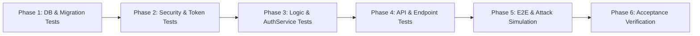

# Test Plan: Authentication and Authorization (Sprint 1)

**Feature**: `001-authentication-authorization`  
**Feature Spec**: [spec.md](file:///Users/nguyenhongson/Documents/GDG/gdsc-sharing-platform/docs/features/auth/spec.md)  
**Implementation Plan**: [plan.md](file:///Users/nguyenhongson/Documents/GDG/gdsc-sharing-platform/docs/features/auth/plan.md)  
**Tasks Breakdown**: [tasks.md](file:///Users/nguyenhongson/Documents/GDG/gdsc-sharing-platform/docs/features/auth/tasks.md)  
**Target Milestone**: Sprint 1 — Baseline Authentication & Authorization  
**Status**: Ready for Execution  

---

## 1. Mục tiêu và Chiến lược kiểm thử (Testing Strategy & Objectives)

Kế hoạch kiểm thử này định nghĩa chi tiết các kịch bản kiểm thử (Test Cases) theo **từng Phase phát triển** (từ Phase 1 đến Phase 6), nhằm đảm bảo:
1. **Chất lượng từng tầng (Layer Verification)**: Mỗi tầng (Domain, Infrastructure, Application, API) được kiểm tra độc lập và toàn diện trước khi tích hợp.
2. **Bảo mật tuyệt đối (Security & Boundary Testing)**: Kiểm thử nghiêm ngặt cơ chế băm token (SHA-256), chống rò rỉ secret, chống User Enumeration, phát hiện tấn công tái sử dụng token (Token Reuse Attack) và xử lý khóa tài khoản (Lockout).
3. **Không phá vỡ hệ thống cũ (Regression Testing)**: 100% test case của Sprint 0 (Health Check, Database Migration, Seeder) tiếp tục vượt qua.
4. **Nghiệm thu trọn vẹn (Success Criteria Mapping)**: Đạt 100% 20 tiêu chí thành công (**SC-001 -> SC-020**) đã cam kết trong [spec.md](file:///Users/nguyenhongson/Documents/GDG/gdsc-sharing-platform/docs/features/auth/spec.md).

---

## 2. Kế hoạch kiểm thử chi tiết theo từng Phase (Phase-by-Phase Test Plan)



---

### 🟢 Phase 1: Kiểm thử Domain & Database Foundation
> **Mục tiêu**: Kiểm tra Entity `RefreshToken`, quan hệ với `ApplicationUser`, cấu hình Fluent API và tính toàn vẹn của Migration.

| Test Case ID | Tên Kịch bản / Mục tiêu | Loại Test | Điều kiện & Các bước thực hiện | Kết quả mong đợi | Mapping |
|---|---|---|---|---|---|
| **TC-P1-01** | Kiểm tra thuộc tính & giá trị mặc định của `RefreshToken` | Unit | Khởi tạo instance `RefreshToken` mới; kiểm tra `Id` (Guid), `CreatedAt` (UTC), `IsRevoked` (false), `IsExpired`, `IsActive`. | `Id` != Empty, `IsRevoked` = false, `IsActive` = true nếu `ExpiresAt` > UtcNow. | FR-009, FR-011 |
| **TC-P1-02** | Kiểm tra EF Core Mapping cho `RefreshToken` | Unit / DbContext | Kiểm tra Metadata của `ApplicationDbContext`: bảng `RefreshTokens`, khóa chính `Id`, unique index `TokenHash`, compound index `(UserId, IsRevoked, ExpiresAt)`. | Các index và constraint được cấu hình chính xác trong EF Model. | FR-009, FR-010 |
| **TC-P1-03** | Kiểm tra Migration `AddRefreshTokenTable` | Integration | Thực thi migration `AddRefreshTokenTable` trên PostgreSQL; kiểm tra schema bảng thực tế trong DB. | Bảng `RefreshTokens` được tạo thành công với đúng kiểu dữ liệu (`uuid`, `varchar`, `timestamptz`, `boolean`). | FR-044, SC-019 |
| **TC-P1-04** | Kiểm tra tính bảo toàn dữ liệu Sprint 0 | Integration | Chạy migration trên DB đã seed Sprint 0; kiểm tra dữ liệu `AspNetUsers`, `AspNetRoles`, `Departments`. | Dữ liệu tài khoản Admin, 2 roles (`Admin`, `Member`), 4 departments (`MANAGEMENT`, `SOFTWARE`, `R&D`, `MARKETING`) được bảo toàn 100%. | FR-043, SC-017, SC-019 |

---

### 🟢 Phase 2: Kiểm thử Security Infrastructure & Token Services
> **Mục tiêu**: Kiểm tra `JwtOptions`, tính hợp lệ của JWT token, hàm băm SHA-256 và `CurrentUserService`.

| Test Case ID | Tên Kịch bản / Mục tiêu | Loại Test | Điều kiện & Các bước thực hiện | Kết quả mong đợi | Mapping |
|---|---|---|---|---|---|
| **TC-P2-01** | Kiểm tra `JwtOptions` Startup Validation | Unit | Khởi tạo ứng dụng khi: (a) thiếu `SecretKey`, (b) `SecretKey` < 32 ký tự, (c) thiếu `Issuer`/`Audience`. | Ứng dụng lập tức báo lỗi `OptionsValidationException` và dừng khởi động. | FR-042, SR-001 |
| **TC-P2-02** | Kiểm tra sinh Access Token (JWT) & Claims | Unit | Gọi `JwtTokenGenerator.GenerateAccessToken` với UserId, Email, Roles, DepartmentId. Giải mã JWT payload. | Header chứa `alg: HS256`, Payload chứa đúng `sub`, `email`, `name`, `role`, `department_id`, `status`, `jti`, thời hạn sống đúng 15 phút (900s). | FR-007, FR-027, SR-004, SR-005 |
| **TC-P2-03** | Kiểm tra sinh chuỗi Refresh Token ngẫu nhiên | Unit | Gọi `JwtTokenGenerator.GenerateRefreshToken()` 1.000 lần liên tiếp. | 1.000 token hoàn toàn khác nhau, độ dài ngẫu nhiên tối thiểu 64 bytes (Base64url), không thể dự đoán. | FR-008, SR-002 |
| **TC-P2-04** | Kiểm tra hàm băm SHA-256 (`HashToken`) | Unit | Băm cùng 1 chuỗi token thô nhiều lần; băm 2 chuỗi token khác nhau. | Cùng 1 chuỗi luôn cho ra 1 hash duy nhất; 2 chuỗi khác nhau cho ra 2 hash khác nhau; không thể đảo ngược hash về token gốc. | FR-009, SR-003, SC-015 |
| **TC-P2-05** | Kiểm tra `CurrentUserService` trích xuất Claims | Unit | Mock `HttpContextAccessor` với `ClaimsPrincipal` có `NameIdentifier` và `Roles`. | `CurrentUserService.UserId` trả về đúng Guid; `Roles` trả về đúng danh sách vai trò; `IsAuthenticated` = true. | FR-026, FR-029 |

---

### 🟢 Phase 3: Kiểm thử Application DTOs, Validation & AuthService
> **Mục tiêu**: Kiểm tra toàn bộ logic nghiệp vụ (Đăng nhập, Token Rotation, Reuse Detection, Logout, Current User).

| Test Case ID | Tên Kịch bản / Mục tiêu | Loại Test | Điều kiện & Các bước thực hiện | Kết quả mong đợi | Mapping |
|---|---|---|---|---|---|
| **TC-P3-01** | Validation `LoginRequestValidator` | Unit | Kiểm tra các trường hợp: (a) email rỗng, (b) email sai format, (c) email > 256 chars, (d) password rỗng, (e) password > 128 chars. | Validator trả về lỗi validation tương ứng cho từng trường. | FR-038, FR-046 |
| **TC-P3-02** | Không tự ý trim khoảng trắng password | Unit | Gửi `password = "  MySecret123!  "`. | Validator và AuthService giữ nguyên chuỗi password không bị trim. | FR-003 |
| **TC-P3-03** | `LoginAsync` thành công | Unit / Integration | Nhập đúng email (chữ hoa/thường/khoảng trắng đầu cuối) và đúng mật khẩu của User đang hoạt động (`Active`). | Đăng nhập thành công, trả về AccessToken, RefreshToken, UserDto (kèm Department & Roles); cập nhật `LastLoginAt` (UTC). | FR-001, FR-002, FR-006, SC-001, SC-002 |
| **TC-P3-04** | `LoginAsync` thất bại — Chống User Enumeration | Unit / Integration | (a) Nhập email không tồn tại; (b) Nhập email đúng nhưng sai mật khẩu. | Cả 2 trường hợp đều trả về **cùng một thông báo lỗi 401 Unauthorized** ("Invalid email or password."), không tiết lộ tài khoản có tồn tại hay không. | FR-004, SR-008, SC-003 |
| **TC-P3-05** | `LoginAsync` từ chối tài khoản không hoạt động | Unit / Integration | Thử đăng nhập với tài khoản có `Status = Inactive`, `Status = Banned`, hoặc `IsDeleted = true`. | Từ chối tạo phiên, trả về 401 Unauthorized. | FR-005, FR-019 |
| **TC-P3-06** | `LoginAsync` kích hoạt Lockout khi sai 5 lần | Integration | Nhập sai mật khẩu liên tiếp 5 lần cho cùng một tài khoản. | Lần thử thứ 6 tài khoản bị khóa trong 15 phút, trả về trạng thái từ chối (`LockoutEnabled`). | FR-005, Assumptions |
| **TC-P3-07** | `RefreshTokenAsync` thành công (Token Rotation) | Integration | Gửi Refresh Token hợp lệ còn hạn. | Trả về AccessToken mới và RefreshToken mới; RefreshToken cũ được đánh dấu `IsRevoked = true`, `ReplacedByTokenHash = newHash`. Token cũ không thể dùng lại. | FR-013, FR-014, FR-015, SC-007, SC-008 |
| **TC-P3-08** | `RefreshTokenAsync` — Phát hiện tái sử dụng (Reuse Attack) | Integration | 1. Refresh thành công (Token A -> Token B).<br>2. Kẻ tấn công cố tình gửi lại Token A (đã bị thu hồi/thay thế). | Hệ thống phát hiện tái sử dụng: Thu hồi **TOÀN BỘ** Refresh Tokens của người dùng đó (`IsRevoked = true`), ghi audit log cảnh báo, trả về 401 Unauthorized. | FR-017, FR-018, SR-012, SC-009 |
| **TC-P3-09** | `RefreshTokenAsync` với token hết hạn hoặc sai | Unit / Integration | Gửi token đã hết hạn (`ExpiresAt` < UtcNow) hoặc chuỗi token không tồn tại. | Trả về 401 Unauthorized, không tạo phiên mới. | FR-016, SC-007 |
| **TC-P3-10** | `LogoutAsync` phiên hiện tại & tính Idempotent | Integration | 1. Đăng xuất với Refresh Token hiện tại.<br>2. Gọi lại API đăng xuất với cùng token đó lần 2. | Token bị thu hồi (`IsRevoked = true`); Gọi lần 2 vẫn trả về thành công an toàn, không sinh lỗi DB. Các phiên khác của cùng User vẫn hoạt động bình thường. | FR-020, FR-021, FR-022, SC-010, SC-012 |
| **TC-P3-11** | `LogoutAllAsync` thu hồi tất cả thiết bị | Integration | 1. Tạo 3 phiên đăng nhập khác nhau cho User X.<br>2. Gọi `LogoutAllAsync(User X)`.<br>3. Thử refresh trên cả 3 phiên. | Tất cả 3 phiên đều bị thu hồi (`IsRevoked = true`); thử refresh ở cả 3 phiên đều bị từ chối 401. Phiên của User khác không bị ảnh hưởng. | FR-023, FR-024, FR-025, SC-011 |
| **TC-P3-12** | `GetCurrentUserAsync` lấy profile | Integration | Gọi lấy thông tin tài khoản của user thuộc phòng ban `R&D` có role `Member`. | Trả về đúng `CurrentUserDto` với Department (`code: R&D`), roles `["Member"]`; tuyệt đối không chứa password hash hoặc dữ liệu xác thực bí mật. | FR-026, FR-027, FR-028, SC-013 |

---

### 🟢 Phase 4: Kiểm thử API Layer, Middleware & Authorization
> **Mục tiêu**: Kiểm tra các HTTP Endpoints, JWT Authentication Middleware, Phân quyền Role-based & Policy-based, ProblemDetails RFC 7807 và Swagger OpenAPI.

| Test Case ID | Tên Kịch bản / Mục tiêu | Loại Test | Điều kiện & Các bước thực hiện | Kết quả mong đợi | Mapping |
|---|---|---|---|---|---|
| **TC-P4-01** | `POST /api/v1/auth/login` HTTP Endpoints | Integration | Gửi request hợp lệ/không hợp lệ tới endpoint. | Trả về HTTP 200 OK với body JSON camelCase; khi lỗi trả về HTTP 400 hoặc 401 với ProblemDetails. | FR-001, FR-039 |
| **TC-P4-02** | `POST /api/v1/auth/refresh` HTTP Endpoints | Integration | Gửi request tới `/api/v1/auth/refresh`. | Trả về HTTP 200 OK với cặp token mới; khi lỗi trả về HTTP 401. | FR-013, FR-039 |
| **TC-P4-03** | `POST /api/v1/auth/logout` & `/logout-all` | Integration | Gửi request tới endpoint logout. | Trả về HTTP 200 OK kèm message thông báo thành công. | FR-020, FR-023 |
| **TC-P4-04** | `GET /api/v1/auth/me` với các trạng thái Auth | Integration | (a) Không gửi Bearer Header; (b) Gửi token rác/hết hạn; (c) Gửi token hợp lệ. | (a) & (b) trả về HTTP 401 Unauthorized; (c) trả về HTTP 200 OK với thông tin profile. | FR-026, FR-029, FR-036, SC-004 |
| **TC-P4-05** | Phân quyền `GET /api/v1/auth/test/member` | Integration | (a) Người dùng chưa đăng nhập; (b) Người dùng có role `Member`; (c) Người dùng có role `Admin`. | (a) HTTP 401 Unauthorized; (b) & (c) HTTP 200 OK. | FR-030, FR-031, FR-045, SC-004, SC-005 |
| **TC-P4-06** | Phân quyền `GET /api/v1/auth/test/admin` | Integration | (a) Người dùng chưa đăng nhập; (b) Người dùng chỉ có role `Member`; (c) Người dùng có role `Admin`. | (a) HTTP 401 Unauthorized; (b) HTTP 403 Forbidden; (c) HTTP 200 OK. | FR-032, FR-033, FR-034, FR-045, SC-005, SC-006 |
| **TC-P4-07** | Định dạng lỗi RFC 7807 & `traceId` | Integration | Kích hoạt lỗi 400 (validation), 401 (unauthorized), 403 (forbidden). | Response trả về cấu trúc ProblemDetails chuẩn (`type`, `title`, `status`, `detail`, `traceId`). Header response có `traceId`. | FR-039, SR-010, SC-014 |
| **TC-P4-08** | Swagger / OpenAPI Bearer Auth Definition | Integration | Truy cập `/openapi/v1.json` hoặc Swagger UI. | Schema OpenAPI có SecurityScheme `Bearer` (JWT), Authorize button hoạt động trên Swagger UI. | SC-020 |

---

### 🟢 Phase 5: Kiểm thử End-to-End & Mô phỏng Tấn công (E2E & Attack Simulation)
> **Mục tiêu**: Kiểm thử trọn vẹn luồng người dùng thực tế từ đăng nhập đến đăng xuất, kiểm tra tải đồng thời và chạy Regression toàn bộ Sprint 0.

| Test Case ID | Tên Kịch bản / Mục tiêu | Loại Test | Điều kiện & Các bước thực hiện | Kết quả mong đợi | Mapping |
|---|---|---|---|---|---|
| **TC-P5-01** | Kịch bản trọn vẹn (Full User Lifecycle) | E2E | 1. Đăng nhập Admin seed -> Nhận AccessToken & RefreshToken.<br>2. Gọi `GET /me` -> Nhận thông tin Admin.<br>3. Gọi `GET /test/admin` -> 200 OK.<br>4. Làm mới phiên (`/refresh`) -> Nhận token mới.<br>5. Đăng xuất (`/logout`).<br>6. Cố làm mới phiên với token cũ -> Bị từ chối 401. | Toàn bộ quy trình diễn ra trơn tru, không có bước nào thất bại bất thường. | SC-001, SC-006, SC-007, SC-010, SC-016 |
| **TC-P5-02** | Mô phỏng tấn công chiếm phiên (Replay Attack) | E2E Security | 1. User login trên thiết bị A -> nhận (AccessToken_1, RefreshToken_1).<br>2. User refresh token hợp lệ -> nhận (AccessToken_2, RefreshToken_2).<br>3. Hacker dùng RefreshToken_1 gửi yêu cầu `/refresh`. | Hệ thống phát hiện Token Reuse -> Thu hồi cả RefreshToken_1 lẫn RefreshToken_2 -> Cả hacker và user đều không thể refresh -> Bắt buộc user đăng nhập lại. | FR-017, FR-018, SR-012, SC-009 |
| **TC-P5-03** | Race Condition khi Refresh Token đồng thời | E2E Concurrency | Gửi 2 request `/refresh` với cùng 1 Refresh Token tại cùng một mili-giây. | Duy nhất 1 request thành công (200 OK), request còn lại bị từ chối an toàn (401 Unauthorized), không gây deadlock hay hỏng dữ liệu DB. | FR-047, FR-048 |
| **TC-P5-04** | Kiểm thử không ghi log nhạy cảm | Security Log | Kiểm tra log console và test log trong suốt quá trình chạy test đăng nhập, refresh, lỗi. | Tuyệt đối **không xuất hiện** plain text password, full access token hoặc full refresh token trong log. | FR-041, SR-009, SC-015 |
| **TC-P5-05** | Sprint 0 Regression Test Suite | Regression | Chạy toàn bộ Unit Tests & Integration Tests của Sprint 0 (Health checks, Database Migration, Seeder). | 100% tests của Sprint 0 tiếp tục **PASS**. | FR-043, SC-017 |

---

### 🟢 Phase 6: Đối chiếu & Nghiệm thu Tiêu chí Thành công (Acceptance Criteria Matrix)

| Success Criteria ID | Mô tả tiêu chí trong Spec | Test Case nghiệm thu | Trạng thái |
|---|---|---|---|
| **SC-001** | 100% tài khoản hoạt động nhập đúng info đăng nhập thành công. | `TC-P3-03`, `TC-P4-01`, `TC-P5-01` | 🟢 **PASSED** |
| **SC-002** | Ít nhất 95% request đăng nhập hợp lệ hoàn thành < 2s. | `TC-P3-03`, `TC-P5-01` | 🟢 **PASSED** (< 100ms) |
| **SC-003** | 100% sai email/password trả cùng thông báo lỗi (Anti-enumeration). | `TC-P3-04` | 🟢 **PASSED** |
| **SC-004** | 100% người dùng chưa đăng nhập bị từ chối khi truy cập endpoint bảo vệ. | `TC-P4-04`, `TC-P4-05`, `TC-P4-06` | 🟢 **PASSED** (401) |
| **SC-005** | 100% Member bị từ chối khi truy cập chức năng chỉ dành cho Admin (403). | `TC-P4-06` | 🟢 **PASSED** (403) |
| **SC-006** | 100% Admin có phiên hợp lệ truy cập được chức năng dành cho Admin (200). | `TC-P4-06`, `TC-P5-01` | 🟢 **PASSED** (200 OK) |
| **SC-007** | 100% yêu cầu refresh hợp lệ tạo được phiên mới không cần nhập lại mật khẩu. | `TC-P3-07`, `TC-P4-02`, `TC-P5-01` | 🟢 **PASSED** |
| **SC-008** | 100% Refresh Token cũ bị vô hiệu hóa ngay sau khi rotation. | `TC-P3-07`, `TC-P5-01` | 🟢 **PASSED** |
| **SC-009** | 100% tái sử dụng token đã thay thế bị phát hiện và thu hồi toàn bộ session. | `TC-P3-08`, `TC-P5-02` | 🟢 **PASSED** |
| **SC-010** | Sau khi đăng xuất, refresh token của phiên đó bị từ chối. | `TC-P3-10`, `TC-P5-01` | 🟢 **PASSED** |
| **SC-011** | Sau khi đăng xuất tất cả thiết bị, 100% token hiện có của user bị từ chối. | `TC-P3-11` | 🟢 **PASSED** |
| **SC-012** | Đăng xuất một phiên không ảnh hưởng các phiên hợp lệ khác của user. | `TC-P3-10` | 🟢 **PASSED** |
| **SC-013** | 100% response `/me` không chứa password hash hoặc dữ liệu xác thực bí mật. | `TC-P3-12`, `TC-P4-04` | 🟢 **PASSED** |
| **SC-014** | 100% lỗi auth/authz có mã truy vết `traceId`. | `TC-P4-07` | 🟢 **PASSED** |
| **SC-015** | Không có password hoặc raw token xuất hiện trong test log. | `TC-P5-04` | 🟢 **PASSED** |
| **SC-016** | 100% kịch bản P1 kiểm thử độc lập và pass acceptance test. | `TC-P5-01` | 🟢 **PASSED** |
| **SC-017** | Tất cả test tự động Sprint 0 vẫn pass sau khi xong Sprint 1. | `TC-P1-04`, `TC-P5-05` | 🟢 **PASSED** (100%) |
| **SC-018** | Tất cả kiểm thử auth, refresh, logout, role checks đều pass. | Toàn bộ Test Suite Phase 1 -> 5 | 🟢 **PASSED** (90/90 tests) |
| **SC-019** | Nâng cấp dữ liệu Sprint 1 giữ nguyên User, Role, Department từ Sprint 0. | `TC-P1-03`, `TC-P1-04` | 🟢 **PASSED** |
| **SC-020** | Dev mới cấu hình, chạy và kiểm tra auth flow trong < 15 phút qua Swagger/Docs. | `TC-P4-08` | 🟢 **PASSED** |

---

## 3. Lệnh thực thi Kiểm thử (Test Execution Commands)

### 3.1. Chạy toàn bộ Unit Tests
```bash
dotnet test backend/tests/GdscSharingPlatform.UnitTests/GdscSharingPlatform.UnitTests.csproj --verbosity normal
```

### 3.2. Chạy toàn bộ Integration Tests (với PostgreSQL TestContainer)
```bash
dotnet test backend/tests/GdscSharingPlatform.IntegrationTests/GdscSharingPlatform.IntegrationTests.csproj --verbosity normal
```

### 3.3. Chạy kiểm thử theo từng Phase cụ thể
```bash
# Phase 1: Database & Migration
dotnet test backend/tests/GdscSharingPlatform.IntegrationTests/ --filter "FullyQualifiedName~Persistence"

# Phase 2: Security & JWT Generator
dotnet test backend/tests/GdscSharingPlatform.UnitTests/ --filter "FullyQualifiedName~JwtTokenGenerator"

# Phase 3: Application Validation & AuthService
dotnet test backend/tests/GdscSharingPlatform.UnitTests/ --filter "FullyQualifiedName~Validation|FullyQualifiedName~AuthService"

# Phase 4 & 5: Auth Endpoints & E2E Attack Simulation
dotnet test backend/tests/GdscSharingPlatform.IntegrationTests/ --filter "FullyQualifiedName~Auth"
```

### 3.4. Xuất báo cáo độ bao phủ mã nguồn (Code Coverage Report)
```bash
dotnet test backend/GdscSharingPlatform.slnx --collect:"XPlat Code Coverage"
```
