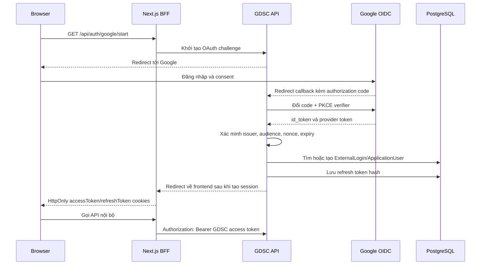

# Implementation Plan: OAuth2/OIDC Social Login

**Feature**: Mở rộng đăng nhập bằng OAuth2/OIDC  
**Related Feature**: [Authentication and Authorization](../auth/spec.md)  
**Created**: 2026-09-18  
**Status**: Planned  
**Target Milestone**: Sprint tiếp theo sau Authentication & Authorization

---

## 1. Mục tiêu

Mở rộng cơ chế đăng nhập hiện tại để người dùng có thể đăng nhập bằng nhà cung cấp bên ngoài, trước mắt là Google OIDC. GitHub hoặc Microsoft có thể được bổ sung sau khi flow Google ổn định.

OAuth2/OIDC chỉ chịu trách nhiệm xác minh danh tính từ nhà cung cấp. Sau khi xác minh thành công, hệ thống vẫn tạo hoặc tìm `ApplicationUser` nội bộ và phát hành access token/refresh token của GDSC theo cơ chế hiện tại.

### Không nằm trong phạm vi

- Không thay thế JWT access token nội bộ của GDSC bằng access token của Google.
- Không triển khai Implicit Flow.
- Không cho phép frontend giữ `client_secret`.
- Không tự động cấp role `Admin` dựa trên thông tin từ provider.
- Không dùng email làm external identity duy nhất.

---

## 2. Kiến trúc và flow tổng thể



### Flow bắt buộc

```text
Authorization Code Flow + PKCE + OIDC
```

- Authorization code chỉ là mã tạm thời, sống ngắn và chỉ dùng một lần.
- PKCE bảo vệ code nếu code bị chặn trên đường redirect.
- `state` chống CSRF.
- `nonce` liên kết authorization request với `id_token` trong OIDC.
- Backend đổi code với provider qua back-channel.

---

## 3. Quyết định thiết kế

### 3.1. Token boundary

| Token | Issuer | Dùng cho |
|---|---|---|
| `authorization_code` | Google | Đổi lấy token, không dùng gọi API |
| Google `id_token` | Google | Xác minh danh tính người dùng |
| Google `access_token` | Google | Chỉ dùng nếu cần gọi Google API |
| GDSC `accessToken` | GDSC API | Gọi API nội bộ |
| GDSC `refreshToken` | GDSC API | Làm mới session GDSC |

API GDSC chỉ chấp nhận JWT do GDSC phát hành. Google token không được gửi trực tiếp tới các endpoint nghiệp vụ của GDSC.

### 3.2. Nơi quản lý cookie

Đối với web browser, Next.js BFF là nơi quản lý cookie `HttpOnly`. Backend vẫn chịu trách nhiệm phát hành và thu hồi session; Next.js chuyển kết quả thành cookie browser.

Đối với mobile hoặc public API client, client có thể nhận token trong response và gửi access token qua:

```http
Authorization: Bearer <gdsc-access-token>
```

Không lưu refresh token trong `localStorage` hoặc cookie có thể đọc bằng JavaScript.

### 3.3. Định danh external account

Định danh ổn định là cặp:

```text
(Provider, ProviderSubject)
```

Ví dụ với Google:

```text
Provider = Google
ProviderSubject = giá trị claim sub
```

Email chỉ được dùng để hỗ trợ tìm user hiện tại, không dùng làm khóa chính cho liên kết provider.

---

## 4. Thiết kế dữ liệu

### 4.1. Tận dụng ASP.NET Core Identity `UserLogins`

ASP.NET Core Identity đã có bảng `UserLogins` từ migration `InitialIdentity`, gồm provider, provider key và user id. Ưu tiên sử dụng `UserManager.AddLoginAsync`/`FindByLoginAsync` thay vì tạo bảng trùng lặp.

Nếu cần lưu thêm thông tin audit hoặc metadata provider, tạo bảng mở rộng riêng:

```text
ExternalLoginMetadata
---------------------
Id
UserId
LoginProvider
ProviderSubject
ProviderEmail
EmailVerified
CreatedAt
LastLoginAt
UpdatedAt
```

Unique index bắt buộc:

```text
UNIQUE (LoginProvider, ProviderSubject)
```

### 4.2. Quy tắc liên kết user

1. Tìm `UserLogin` bằng `LoginProvider + ProviderSubject`.
2. Nếu tìm thấy, đăng nhập user nội bộ tương ứng.
3. Nếu chưa tìm thấy, kiểm tra email provider đã được xác minh.
4. Nếu email trùng user nội bộ, chỉ tự động liên kết khi policy cho phép.
5. Nếu chưa có user, tạo `ApplicationUser` với trạng thái mặc định phù hợp.
6. Tạo liên kết external login.
7. Kiểm tra `UserStatus` và `IsDeleted` trước khi phát hành session.

Không cho phép external provider tự quyết định role. Role lấy từ database GDSC.

---

## 5. API contract dự kiến

### 5.1. Bắt đầu đăng nhập

```http
GET /api/auth/google/start
```

Hành vi:

- Tạo `state`, `nonce` và PKCE `code_verifier`.
- Lưu dữ liệu tạm trong server-side session hoặc state store có TTL ngắn.
- Redirect tới Google authorization endpoint.

### 5.2. Callback

```http
GET /api/auth/google/callback?code=...&state=...
```

Hành vi:

- Kiểm tra `state`.
- Kiểm tra code không rỗng và chưa bị sử dụng.
- Đổi code lấy token qua back-channel.
- Xác minh OIDC `id_token`.
- Tìm hoặc tạo liên kết user nội bộ.
- Kiểm tra trạng thái tài khoản.
- Tạo access token và refresh token GDSC.
- Lưu refresh token dạng hash và áp dụng rotation như login hiện tại.
- Redirect về frontend với kết quả thành công hoặc mã lỗi an toàn.

Không đưa access token hoặc refresh token vào query string redirect.

### 5.3. Hủy liên kết provider

Có thể triển khai sau:

```http
DELETE /api/auth/external-logins/{provider}
```

Chỉ cho phép hủy liên kết khi user vẫn còn một phương thức đăng nhập khác. Không được để user mất toàn bộ phương thức đăng nhập.

---

## 6. Phân chia trách nhiệm theo layer

| Layer | Thành phần | Trách nhiệm |
|---|---|---|
| Domain | Constants/enums | Tên provider và các rule nghiệp vụ thuần túy nếu cần |
| Application | Interfaces, DTOs, use cases | Hợp đồng external login, liên kết user, policy liên kết |
| Infrastructure | Identity/OIDC services | Middleware provider, gọi token endpoint, xử lý `UserManager`, persistence |
| API | Controller/configuration | Callback HTTP, redirect, cookie, error mapping |
| Frontend | Next.js route/button | Bắt đầu flow, nhận redirect, tải `/api/auth/me` |
| Tests | Unit/integration | Kiểm thử flow, security và liên kết user |

Dependency direction vẫn giữ nguyên:

```text
API → Application
API → Infrastructure
Infrastructure → Application
Infrastructure → Domain
Application → Domain
```

---

## 7. Kế hoạch triển khai theo phase

### Phase 0 — Chuẩn bị provider

- [ ] Tạo Google OAuth/OIDC application cho development.
- [ ] Tạo OAuth/OIDC application riêng cho production.
- [ ] Đăng ký callback URL chính xác theo từng môi trường.
- [ ] Xác định allowed frontend redirect URLs.
- [ ] Đưa `ClientId` và `ClientSecret` vào User Secrets/environment variables.
- [ ] Không commit credential vào `appsettings.json`, `.env` hoặc repository.

### Phase 1 — Cấu hình OIDC backend

- [ ] Tạo options `GoogleAuthenticationOptions` hoặc cấu hình section `Authentication:Google`.
- [ ] Validate bắt buộc `ClientId`, `ClientSecret`, callback path khi ứng dụng khởi động.
- [ ] Đăng ký authentication scheme Google/OIDC.
- [ ] Cấu hình `CallbackPath`.
- [ ] Bật kiểm tra HTTPS ở production.
- [ ] Không lưu provider token nếu không có use case gọi Google API.
- [ ] Cấu hình `state`, `nonce` và PKCE.

### Phase 2 — External login application service

- [ ] Tạo `IExternalLoginService` trong Application.
- [ ] Tạo DTO kết quả xác minh provider, không đưa provider token ra ngoài service.
- [ ] Tìm user bằng `UserManager.FindByLoginAsync`.
- [ ] Xử lý first login, returning login và account linking.
- [ ] Kiểm tra email verified, provider subject, issuer, audience và expiry.
- [ ] Kiểm tra user active trước khi tạo session.
- [ ] Tái sử dụng `IJwtTokenGenerator` và logic refresh token hiện tại.
- [ ] Ghi nhận `LastLoginAt` và security audit event.

### Phase 3 — API endpoints

- [ ] Thêm `GET /api/auth/google/start`.
- [ ] Thêm `GET /api/auth/google/callback`.
- [ ] Giữ nguyên `/api/auth/refresh`, `/api/auth/logout`, `/api/auth/me`.
- [ ] Map lỗi callback về mã lỗi an toàn, không trả chi tiết token/provider.
- [ ] Không log authorization code, id token, access token hoặc refresh token.
- [ ] Bảo đảm callback không bị chặn bởi policy `RequireActiveUser`.
- [ ] Chỉ callback thành công mới tạo session nội bộ.

### Phase 4 — Next.js client/BFF

- [ ] Thêm nút `Đăng nhập bằng Google` vào login form.
- [ ] Tạo route `/api/auth/google/start` hoặc redirect trực tiếp tới backend tùy mô hình BFF đã chọn.
- [ ] Tạo route nhận callback nếu Next.js là callback owner.
- [ ] Ghi access/refresh token vào HttpOnly cookie theo convention hiện tại.
- [ ] Xóa cookie cũ khi callback thất bại hoặc refresh bị từ chối.
- [ ] Sau callback, redirect về `/` hoặc trang người dùng yêu cầu trước đó.
- [ ] Gọi `/api/auth/me` để hydrate user state.
- [ ] Không decode JWT ở client để quyết định quyền bảo mật; route guard chỉ hỗ trợ UX.

### Phase 5 — Observability và hardening

- [ ] Ghi log thành công/thất bại với `traceId`, provider và user id nếu đã xác định.
- [ ] Redact toàn bộ token và authorization code khỏi log.
- [ ] Rate-limit start/callback endpoint.
- [ ] Giới hạn TTL cho state/nonce/PKCE transaction.
- [ ] Bảo đảm state transaction chỉ dùng một lần.
- [ ] Kiểm tra open redirect: chỉ redirect tới allowlist URL.
- [ ] Kiểm tra CORS, cookie `Secure`, `HttpOnly`, `SameSite` theo môi trường.
- [ ] Có cơ chế thu hồi session nội bộ sau khi tài khoản bị disable.

### Phase 6 — Mở rộng provider

- [ ] Trừu tượng hóa provider-specific mapping sau khi Google hoàn tất.
- [ ] Thêm GitHub hoặc Microsoft với cùng contract.
- [ ] Kiểm tra khác biệt claim: `sub`, email, email verified, display name.
- [ ] Viết policy riêng cho provider không cung cấp email verified.

---

## 8. Cấu hình môi trường dự kiến

```dotenv
AUTHENTICATION__GOOGLE__CLIENTID=...
AUTHENTICATION__GOOGLE__CLIENTSECRET=...
AUTHENTICATION__GOOGLE__CALLBACKPATH=/api/auth/google/callback
AUTHENTICATION__ALLOWEDREDIRECTURLS=http://localhost:3000,https://app.example.com
```

Tên biến cần thống nhất với convention cấu hình .NET hiện tại. Credential development và production phải tách riêng.

---

## 9. Kiểm thử

### Unit tests

- [ ] Parse provider identity với đủ và thiếu claim.
- [ ] Từ chối token sai issuer.
- [ ] Từ chối token sai audience.
- [ ] Từ chối token hết hạn.
- [ ] Từ chối email chưa verified theo policy.
- [ ] Tìm đúng user từ `Provider + ProviderSubject`.
- [ ] Không tạo trùng external login khi callback lặp.
- [ ] Không cấp role từ claim provider.
- [ ] Không phát hành session cho user inactive/deleted.
- [ ] Redirect URL chỉ nhận giá trị nằm trong allowlist.

### Integration tests

- [ ] Start endpoint tạo redirect hợp lệ.
- [ ] Callback với state hợp lệ tạo user/login liên kết.
- [ ] Callback với state sai trả lỗi và không tạo session.
- [ ] Callback dùng lại authorization code bị từ chối.
- [ ] First login tạo đúng user và `UserLogin`.
- [ ] Returning login không tạo user trùng.
- [ ] Email provider trùng email nội bộ được xử lý đúng policy.
- [ ] User inactive không đăng nhập được bằng provider.
- [ ] Sau OAuth, `/api/auth/me` trả đúng user nội bộ.
- [ ] Refresh token rotation, logout và logout-all hoạt động như login password.
- [ ] Access token Google không được chấp nhận ở API GDSC.

### Manual security verification

- [ ] Kiểm tra token không xuất hiện trong URL sau callback.
- [ ] Kiểm tra cookie có `HttpOnly`, `Secure` ở production và `SameSite` phù hợp.
- [ ] Kiểm tra secret không xuất hiện trong bundle frontend hoặc log.
- [ ] Kiểm tra open redirect bằng URL ngoài allowlist.
- [ ] Kiểm tra callback bị gọi đồng thời hoặc lặp nhiều lần.

---

## 10. Tiêu chí nghiệm thu

1. Người dùng có thể đăng nhập bằng Google trên development và production.
2. Mật khẩu Google không bao giờ đi qua hoặc được lưu trong hệ thống GDSC.
3. Backend tạo hoặc liên kết đúng `ApplicationUser`.
4. External identity được định danh bằng provider subject, không chỉ bằng email.
5. GDSC phát hành token nội bộ sau OAuth thành công.
6. Các endpoint hiện tại `/me`, `/refresh`, `/logout` vẫn hoạt động.
7. User bị vô hiệu hóa không thể đăng nhập hoặc refresh session.
8. Sai `state`, sai `nonce`, sai issuer/audience hoặc code đã dùng đều bị từ chối.
9. Không có access token/refresh token trong URL, log hoặc JavaScript-readable storage.
10. Unit test và integration test cho các nhánh bảo mật quan trọng đều đạt.

---

## 11. Rủi ro và cách giảm thiểu

| Rủi ro | Cách giảm thiểu |
|---|---|
| Authorization code bị chặn | Authorization Code + PKCE, HTTPS, state một lần |
| CSRF callback | Kiểm tra state và nonce |
| Account takeover do liên kết email | Chỉ liên kết email verified và theo policy rõ ràng |
| Open redirect | Allowlist redirect URL, không tin `returnUrl` từ client |
| Token bị lộ trong browser | Không dùng Implicit Flow, token ở HttpOnly cookie |
| Provider token bị dùng nhầm | Chỉ API GDSC token mới được chấp nhận ở resource server |
| Callback bị replay | Authorization code dùng một lần, state transaction TTL ngắn |
| User bị cấp sai quyền | Role lấy từ database nội bộ, không lấy từ provider claim |
| Hai nguồn quản lý cookie | Chọn Next.js BFF làm cookie owner cho browser |

---

## 12. Thứ tự triển khai đề xuất

```text
Google OIDC configuration
        ↓
Backend callback + identity verification
        ↓
User linking với ASP.NET Identity UserLogins
        ↓
Phát hành token GDSC hiện tại
        ↓
Next.js login button và callback/BFF
        ↓
Security tests và integration tests
        ↓
Provider thứ hai (GitHub/Microsoft)
```

Chỉ bắt đầu provider thứ hai sau khi toàn bộ flow Google, account linking, refresh rotation và logout đã được kiểm thử đầy đủ.
