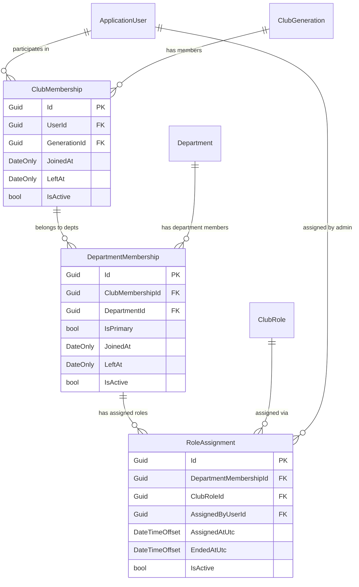
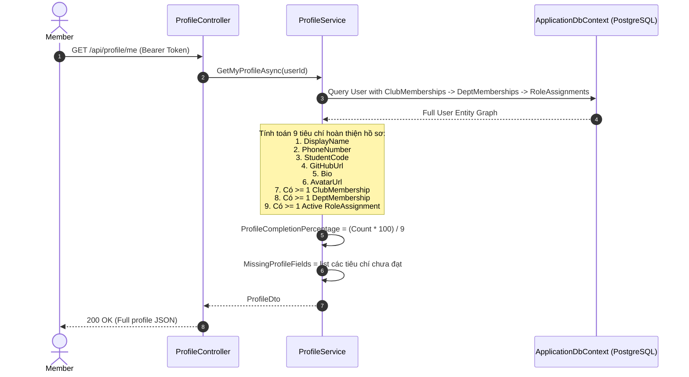
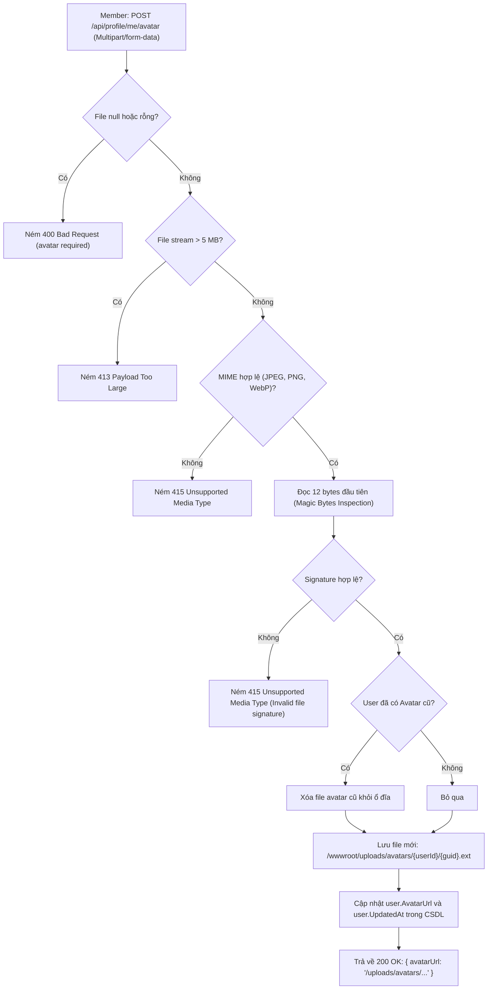
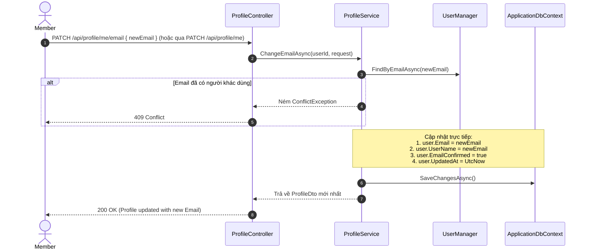
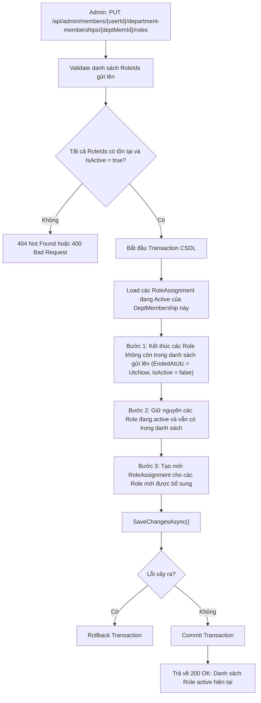

# Báo cáo Tổng kết Tính năng Backend: Member Profile & Membership Management (Sprint 2)

Tài liệu này tổng hợp toàn diện các tính năng đã thay đổi, sơ đồ luồng dữ liệu (workflow) và giải thích chi tiết các khối mã nguồn nghiệp vụ cốt lõi theo đúng chuẩn kỹ thuật trong [02_PROFILE_SPEC.md](./02_PROFILE_SPEC.md), [02_API_CONTRACT.md](./02_API_CONTRACT.md), và [02_STRUCTURE.md](./02_STRUCTURE.md).

---

## 1. Bảng thống kê các thành phần đã triển khai

| Tầng kiến trúc | Thành phần / File | Loại thay đổi | Mô tả chức năng |
| :--- | :--- | :---: | :--- |
| **Domain** | `BaseEntity.cs` | **NEW** | Lớp thực thể cơ sở cung cấp `Id`, `CreatedAtUtc`, `UpdatedAtUtc`. |
| | `ClubGeneration.cs` | **NEW** | Quản lý nhiệm kỳ CLB (`Number`, `Name`, `StartDate`, `EndDate`, `IsActive`). |
| | `ClubRole.cs` | **NEW** | Quản lý chức danh CLB (`Code`, `Name`, `Level`, `IsActive`). |
| | `SystemClubRoles.cs` | **NEW** | Hằng số 4 chức danh chuẩn: `LEAD`, `SUBLEAD`, `CORETEAM`, `ALUMNI`. |
| | `ClubMembership.cs` | **NEW** | Quan hệ Member tham gia vào một Generation cụ thể. |
| | `DepartmentMembership.cs` | **NEW** | Quan hệ Member tham gia vào Ban trong Generation (`IsPrimary`, `JoinedAt`, `LeftAt`). |
| | `RoleAssignment.cs` | **NEW** | Gán chức danh trong Ban (`AssignedAtUtc`, `AssignedByUserId`, `EndedAtUtc`, `IsActive`). |
| | `Department.cs` | **REFACTOR** | Mở rộng danh mục phòng ban động (`Slug`, `Color`, `Icon`, `SortOrder`), chuyển vào namespace `GdscSharingPlatform.Domain.Departments`. |
| | `SystemDepartments.cs` | **NEW** | Danh mục hằng số 5 phòng ban chuẩn (`Software`, `AI`, `Marketing`, `Media`, `Community`). |
| | `UserStatus.cs` | **KEPT** | Enum trạng thái tài khoản: `Active`, `Suspended`, `Inactive`. |
| **Application** | `ProfileDto.cs` | **NEW** | DTO trả về hồ sơ hoàn chỉnh, cây phân cấp Generation $\rightarrow$ Department $\rightarrow$ Roles, % hoàn thiện và danh sách trường còn thiếu. |
| | `UpdateProfileRequest.cs` | **NEW** | DTO cập nhật `DisplayName`, `PhoneNumber`, `StudentCode`, `GitHubUrl`, `Bio`. |
| | `ProfileValidators.cs` | **NEW** | FluentValidation cho Profile, Đổi Email, Xác nhận Email. |
| | `GenerationModels.cs` | **NEW** | DTO CRUD Generation (`GenerationDto`, `CreateGenerationRequest`, `UpdateGenerationRequest`). |
| | `DepartmentModels.cs` | **NEW** | DTO CRUD Department (`DepartmentDetailDto`, `CreateDepartmentRequest`, `UpdateDepartmentRequest`). |
| | `AdminMembershipModels.cs` | **NEW** | DTO gán Gen, gán Department, cập nhật `isPrimary`, `ReplaceRolesRequest`. |
| | `MembershipValidators.cs` | **NEW** | FluentValidation kiểm tra Slug, Hex color `#RGB/#RRGGBB`, ngày bắt đầu/kết thúc Gen. |
| | `IProfileService.cs` | **NEW** | Giao diện nghiệp vụ Profile cá nhân. |
| | `IMembershipServices.cs` | **NEW** | Giao diện nghiệp vụ: `ILookupService`, `IDepartmentService`, `IGenerationService`, `IMemberMembershipService`. |
| | `IFileStorageService.cs` | **NEW** | Hợp đồng lưu trữ file ảnh avatar. |
| | `IEmailSender.cs` | **NEW** | Hợp đồng gửi email xác nhận đổi email. |
| | `PayloadTooLargeException.cs` | **NEW** | Ngoại lệ khi file vượt quá 5MB (ánh xạ HTTP 413). |
| | `UnsupportedMediaTypeException.cs` | **NEW** | Ngoại lệ khi định dạng/magic bytes file không hợp lệ (ánh xạ HTTP 415). |
| **Infrastructure** | `ProfileService.cs` | **NEW** | Cài đặt logic Profile, thuật toán tính tỷ lệ hoàn thiện hồ sơ, unique MSSV, email change flow. |
| | `DepartmentService.cs` | **NEW** | CRUD Department, kích hoạt / hủy kích hoạt soft delete, kiểm tra trùng lặp Name/Slug. |
| | `GenerationService.cs` | **NEW** | Quản lý Gen, kiểm tra trùng số hiệu Gen, kích hoạt / hủy kích hoạt. |
| | `MemberMembershipService.cs` | **NEW** | Quản lý gán Gen, gán Ban, **Role Replacement Transaction**, kết thúc mềm bảo lưu lịch sử. |
| | `LookupService.cs` | **NEW** | Dịch vụ tra cứu nhanh Gen, Ban, Role hỗ trợ cờ `includeInactive`. |
| | `LocalFileStorageService.cs` | **NEW** | Kiểm tra kích thước $\le$ 5MB, magic bytes signature (JPEG, PNG, WebP), lưu trữ `wwwroot/uploads/avatars/`. |
| | `LoggingEmailSender.cs` | **NEW** | Giả lập gửi email xác nhận đổi email qua log có cấu trúc. |
| | `Configurations/` | **REFACTOR** | Tổ chức lại cấu hình EF Core vào các thư mục con: `Departments/`, `Memberships/`, `Identity/`. |
| | `LegacyProfileBackfillService.cs` | **NEW** | Migration và backfill dữ liệu cũ sang cấu trúc đa nhiệm kỳ, đa ban, đa chức danh. |
| | `DatabaseSeeder.cs` | **UPDATE** | Seed idempotent Club Roles và Departments động. |
| **API** | `ProfileController.cs` | **NEW** | 5 endpoints: `GET /me`, `PATCH /me` (hỗ trợ cập nhật thông tin hồ sơ từng phần & email), `PATCH /me/email` (đổi email trực tiếp không cần confirm), `POST /me/avatar`, `DELETE /me/avatar` (hỗ trợ backward-compatible cả PUT). |
| | `GenerationsController.cs` | **NEW** | Lookup Generation (`GET /api/generations`). |
| | `DepartmentsController.cs` | **NEW** | Lookup Department (`GET /api/departments`). |
| | `ClubRolesController.cs` | **NEW** | Lookup Club Role (`GET /api/club-roles`). |
| | `AdminDepartmentsController.cs` | **NEW** | Admin CRUD Department (`POST`, `PUT`, `DELETE`, `POST /activate`). |
| | `AdminGenerationsController.cs` | **NEW** | Admin CRUD Generation (`POST`, `PUT`, `DELETE`). |
| | `AdminMemberMembershipsController.cs` | **NEW** | Admin Member Membership & Role Assignment management. |
| | `GlobalExceptionHandler.cs` | **UPDATE** | Bổ sung ánh xạ FluentValidation (400), `PayloadTooLargeException` (413), `UnsupportedMediaTypeException` (415). |
| | `Program.cs` | **UPDATE** | Thêm `app.UseStaticFiles()` phục vụ ảnh avatar. |

---

## 2. Sơ đồ luồng hoạt động (Workflows)

### 2.1. Cấu trúc quan hệ thực thể (Domain Entity Hierarchy)



---

### 2.2. Luồng lấy thông tin Profile và tính toán tỷ lệ hoàn thiện (`GET /api/profile/me`)



---

### 2.3. Luồng Upload và Kiểm duyệt Avatar (`POST /api/profile/me/avatar`)



---

### 2.4. Luồng Đổi Email trực tiếp (`PATCH /api/profile/me/email` hoặc `PATCH /api/profile/me`)

Thành viên có thể tự do cập nhật Email trực tiếp trong hồ sơ mà không cần kiểm tra mật khẩu hay gửi token xác nhận (hệ thống chỉ kiểm tra trùng lặp email với người dùng khác):



---

### 2.5. Transaction Thay thế Chức danh (`PUT /api/admin/.../roles`)



---

## 3. Giải thích chi tiết mã nguồn cốt lõi (Code Highlights)

### 3.1. Thuật toán tính tỷ lệ hoàn thiện hồ sơ (`ProfileService.cs`)
Theo mục 13 của `02_PROFILE_SPEC.md`, hệ thống chia tổng cộng **9 tiêu chí** (6 trường cá nhân + 3 trường tổ chức):
```csharp
var missingFields = new List<string>();

// 6 tiêu chí thông tin cá nhân
if (string.IsNullOrWhiteSpace(user.DisplayName)) missingFields.Add("displayName");
if (string.IsNullOrWhiteSpace(user.PhoneNumber)) missingFields.Add("phoneNumber");
if (string.IsNullOrWhiteSpace(user.StudentCode)) missingFields.Add("studentCode");
if (string.IsNullOrWhiteSpace(user.GitHubUrl)) missingFields.Add("githubUrl");
if (string.IsNullOrWhiteSpace(user.Bio)) missingFields.Add("bio");
if (string.IsNullOrWhiteSpace(user.AvatarUrl)) missingFields.Add("avatarUrl");

// 3 tiêu chí tổ chức & nhiệm kỳ
var hasClubMembership = user.ClubMemberships != null && user.ClubMemberships.Count > 0;
if (!hasClubMembership) missingFields.Add("clubMemberships");

var allDeptMemberships = user.ClubMemberships?.SelectMany(cm => cm.DepartmentMemberships).ToList() ?? new();
var hasDeptMembership = allDeptMemberships.Count > 0;
if (!hasDeptMembership) missingFields.Add("departmentMemberships");

var hasActiveRole = allDeptMemberships.SelectMany(dm => dm.RoleAssignments).Any(ra => ra.IsActive);
if (!hasActiveRole) missingFields.Add("roleAssignments");

// Tính phần trăm động không lưu cứng vào DB
var completedCount = 9 - missingFields.Count;
var completionPercentage = (completedCount * 100) / 9;
```

---

### 3.2. Kiểm tra Magic Bytes và an toàn lưu trữ Avatar (`LocalFileStorageService.cs`)
Thay vì chỉ tin tưởng đuôi file hoặc MIME header (có thể bị giả mạo), service đọc trực tiếp byte đầu của file:
```csharp
private static bool IsValidImageSignature(byte[] header, int length, out string extension)
{
    extension = string.Empty;
    if (length < 4) return false;

    // JPEG: FF D8 FF
    if (header[0] == 0xFF && header[1] == 0xD8 && header[2] == 0xFF)
    {
        extension = ".jpg";
        return true;
    }

    // PNG: 89 50 4E 47
    if (header[0] == 0x89 && header[1] == 0x50 && header[2] == 0x4E && header[3] == 0x47)
    {
        extension = ".png";
        return true;
    }

    // WebP: RIFF (4 bytes) + File Size (4 bytes) + WEBP (4 bytes)
    if (length >= 12 &&
        header[0] == 0x52 && header[1] == 0x49 && header[2] == 0x46 && header[3] == 0x46 &&
        header[8] == 0x57 && header[9] == 0x45 && header[10] == 0x42 && header[11] == 0x50)
    {
        extension = ".webp";
        return true;
    }

    return false;
}
```

---

### 3.3. Transaction Thay thế Chức danh an toàn (`MemberMembershipService.cs`)
Đảm bảo tính bất biến của lịch sử: không bao giờ xóa cứng dòng role cũ, mà đánh dấu `EndedAtUtc` và kết thúc mềm:
```csharp
var activeAssignments = await _dbContext.RoleAssignments
    .Where(ra => ra.DepartmentMembershipId == departmentMembershipId && ra.IsActive)
    .ToListAsync(cancellationToken);

// 1. Kết thúc các role không còn nằm trong target list
foreach (var assignment in activeAssignments)
{
    if (!targetRoleIds.Contains(assignment.ClubRoleId))
    {
        assignment.End(); // Đặt IsActive = false, EndedAtUtc = UtcNow
    }
}

// 2. Thêm mới các role chưa có
var activeRoleIds = activeAssignments.Where(ra => ra.IsActive).Select(ra => ra.ClubRoleId).ToHashSet();
foreach (var roleId in targetRoleIds)
{
    if (!activeRoleIds.Contains(roleId))
    {
        var newAssignment = new RoleAssignment(departmentMembershipId, roleId, currentUserId);
        _dbContext.RoleAssignments.Add(newAssignment);
    }
}

await _dbContext.SaveChangesAsync(cancellationToken);
```

---

### 3.4. Ánh xạ lỗi chuẩn RFC 7807 (`GlobalExceptionHandler.cs`)
Toàn bộ mã lỗi từ `02_API_CONTRACT.md` được tự động chuyển thành JSON ProblemDetails:
* `400 Bad Request`: Lỗi validation dữ liệu (`FluentValidation` hoặc `ApplicationValidationException`).
* `401 Unauthorized`: Chưa đăng nhập hoặc mật khẩu sai (`AuthenticationException`).
* `403 Forbidden`: Người dùng không có quyền Admin (`ForbiddenAccessException`).
* `404 Not Found`: Không tìm thấy thực thể (`NotFoundException`).
* `409 Conflict`: Trùng lặp `StudentCode`, trùng `Slug` ban, trùng số `Number` Gen, hoặc thành viên đã ở trong Gen/Ban (`ConflictException`).
* `413 Payload Too Large`: Upload file vượt quá 5MB (`PayloadTooLargeException`).
* `415 Unsupported Media Type`: File không đúng định dạng ảnh hoặc magic bytes sai (`UnsupportedMediaTypeException`).

---

## 4. Tổng kết kiểm thử tự động (Test Suite)

Hệ thống đã bổ sung đầy đủ Unit Tests và Integration Tests cho toàn bộ tính năng mới:

```text
======================= TEST RUN SUMMARY =======================
Project: GdscSharingPlatform.UnitTests.dll (net10.0)
Passed:  166 / 166 tests (100%) - Thời gian: ~2s
- Domain entity tests (Department, Memberships, ApplicationUser)
- FluentValidation tests (Profile, Memberships, Generations, Departments)
- LocalFileStorageService tests (JPEG, PNG, WebP, >5MB, invalid magic bytes, file deletion)
- Service tests (ProfileService, DepartmentService, GenerationService, MemberMembershipService)

Project: GdscSharingPlatform.IntegrationTests.dll (net10.0)
Passed:  28 / 28 tests (100%) - Thời gian: ~6s
- Auth endpoints tests (Login, Refresh, Logout)
- Profile endpoints tests (GET /me, PUT /me, Avatar upload/delete, direct Email change)
- Lookup endpoints tests (Generations, Departments, ClubRoles with Member vs Admin permissions)
- Admin Department endpoints tests (Create, Update, Deactivate, Activate, 403 Forbidden check)
- Admin Generation endpoints tests (Create, Deactivate)

TỔNG CỘNG: 194 / 194 TESTS PASS (0 FAILED, 0 SKIPPED)
================================================================
```
