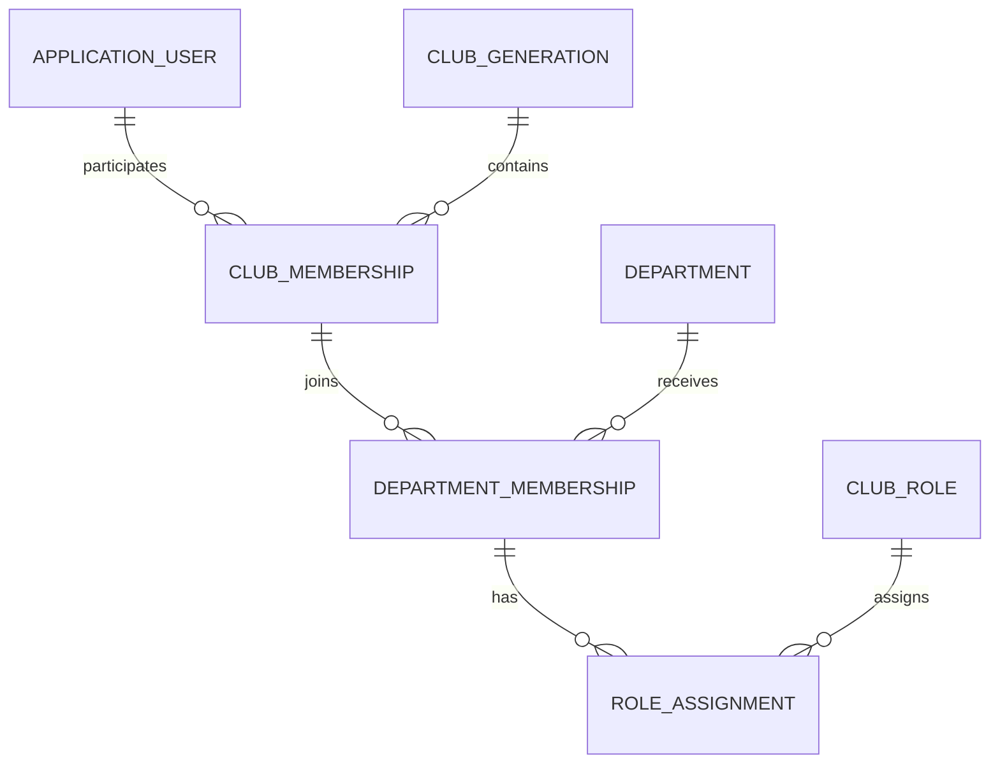

# ĐẶC TẢ RAW — SPRINT 2: MEMBER PROFILE

## 1. Thông tin Sprint

| Thuộc tính          | Nội dung                                                                                                   |
| ------------------- | ---------------------------------------------------------------------------------------------------------- |
| Dự án               | GDSC Sharing Platform                                                                                      |
| Sprint              | Sprint 2 — Member Profile                                                                                  |
| Tên chức năng       | Hồ sơ thành viên và quản lý thông tin tham gia câu lạc bộ                                                  |
| Mục tiêu            | Cho phép thành viên cập nhật hồ sơ cá nhân và hiển thị lịch sử tham gia theo nhiều Gen, Department và Role |
| Backend             | ASP.NET Core, Identity, EF Core, PostgreSQL                                                                |
| Frontend            | Next.js, TypeScript, Axios, TanStack Query, Zustand                                                        |
| Actor               | Member, Admin                                                                                              |
| Phụ thuộc           | Sprint 1 Authentication hoàn thành                                                                         |
| Trạng thái tài liệu | Raw specification để triển khai và nghiệm thu                                                              |

## 2. Bối cảnh

Sprint 1 đã cung cấp authentication, JWT access token, refresh-token rotation,
logout và current-user API. Sprint 2 mở rộng tài khoản Identity thành hồ sơ thành
viên của câu lạc bộ.

Khác với mô hình profile đơn giản, thành viên GDSC có thể:

- tham gia câu lạc bộ qua nhiều nhiệm kỳ khác nhau;
- tham gia nhiều Department trong cùng một Gen hoặc ở các Gen khác nhau;
- giữ nhiều Role trong một Department;
- có Role khác nhau giữa từng Gen và từng Department.

Ví dụ:

```text
Nguyễn Văn A
├── Gen 2
│   ├── Software: Core Team
│   └── Media: Core Team
└── Gen 3
    ├── Software: Lead
    └── AI: Sub Lead, Core Team
```

Vì vậy, không được tiếp tục lưu trực tiếp một `Generation`, một `DepartmentId`
hoặc một `ClubRole` duy nhất trên `ApplicationUser`.

## 3. Sprint Goal

Kết thúc Sprint 2:

1. Member xem được đầy đủ hồ sơ cá nhân.
2. Member chỉnh sửa được các trường cá nhân được cho phép.
3. Member tải lên, thay đổi hoặc xóa avatar.
4. Member thực hiện thay đổi email qua quy trình riêng an toàn.
5. Profile hiển thị được nhiều Gen.
6. Trong mỗi Gen, profile hiển thị được nhiều Department.
7. Trong mỗi Department, profile hiển thị được nhiều Role.
8. Admin quản lý được Gen, Department và Role assignment của thành viên.
9. Admin thêm, chỉnh sửa và ngừng sử dụng Department.
10. Dữ liệu profile sẵn sàng cho Member Directory, Sharing Content và Roadmap.

## 4. Yêu cầu nghiệp vụ gốc

Chức năng profile quản lý các thông tin:

- Gen — nhiệm kỳ tham gia câu lạc bộ, ví dụ Gen 1, Gen 2, Gen 3;
- mã số sinh viên;
- Role trong câu lạc bộ;
- số điện thoại;
- họ và tên;
- email;
- GitHub URL;
- Bio;
- Department;
- avatar.

Role ban đầu:

```text
Lead
Sub Lead
Core Team
```

Department ban đầu:

```text
Software
AI
Marketing
Media
Community
```

Quan hệ bắt buộc:

- một Member có thể tham gia nhiều Gen;
- một Member có thể tham gia nhiều Department;
- trong mỗi Department, Member có thể giữ nhiều Role;
- Role phải được xác định theo đúng Gen và Department;
- Admin có thể thêm Department mới.

## 5. Quyết định mô hình hóa

### 5.1. System Role và Club Role là hai khái niệm khác nhau

| Khái niệm   | Giá trị ví dụ                 | Mục đích                                       |
| ----------- | ----------------------------- | ---------------------------------------------- |
| System Role | `Admin`, `Member`             | Phân quyền hệ thống bằng ASP.NET Core Identity |
| Club Role   | `Lead`, `SubLead`, `CoreTeam` | Chức danh trong một Department của một Gen     |

Không dùng Club Role để thay thế Identity Role.

Người giữ Club Role `Lead` không tự động có quyền system `Admin`.

### 5.2. Gen là danh mục động

Gen không lưu dưới dạng chuỗi tự do trên User. Gen là một entity riêng để:

- một Member tham gia nhiều Gen;
- quản lý thời gian bắt đầu và kết thúc nhiệm kỳ;
- ngừng sử dụng Gen cũ nhưng vẫn giữ lịch sử;
- tránh dữ liệu không thống nhất như `gen1`, `Gen 1`, `GEN1`.

### 5.3. Department là danh mục động

Department là entity riêng và Admin được phép thêm mới.

Không hard-code danh sách Department trong frontend hoặc enum backend.

### 5.4. Role được gán theo Department và Gen

Role không gắn trực tiếp vào User.

Role được gán cho quan hệ:

```text
Member + Gen + Department
```

Điều này cho phép một thành viên là:

```text
Lead của Software ở Gen 3
Core Team của AI ở Gen 3
```

### 5.5. Profile server state không lưu trong Zustand

Frontend lưu profile, Gen, Department và Role assignments trong TanStack Query
cache. Zustand chỉ quản lý session và client-only UI state.

## 6. Thuật ngữ

| Thuật ngữ             | Định nghĩa                                           |
| --------------------- | ---------------------------------------------------- |
| Member                | Người dùng có tài khoản và system role `Member`      |
| Gen                   | Một nhiệm kỳ của câu lạc bộ                          |
| Club Membership       | Quan hệ một Member tham gia một Gen                  |
| Department            | Nhóm chuyên môn hoặc vận hành trong câu lạc bộ       |
| Department Membership | Quan hệ Member tham gia một Department trong một Gen |
| Club Role             | Chức danh của Member trong Department của Gen cụ thể |
| Role Assignment       | Quan hệ gán một Club Role cho Department Membership  |
| System Role           | Role dùng để phân quyền hệ thống bằng Identity       |

## 7. Phạm vi Sprint

### 7.1. Trong phạm vi

- Xem hồ sơ hiện tại.
- Chỉnh sửa họ và tên.
- Chỉnh sửa mã số sinh viên.
- Chỉnh sửa số điện thoại.
- Chỉnh sửa GitHub URL.
- Chỉnh sửa Bio.
- Thay đổi email qua flow riêng.
- Upload, thay đổi và xóa avatar.
- Hiển thị nhiều Gen của Member.
- Hiển thị nhiều Department trong từng Gen.
- Hiển thị nhiều Role trong từng Department.
- Admin tạo, sửa và deactivate Department.
- Admin tạo và quản lý Gen.
- Admin gán hoặc gỡ Member khỏi Gen.
- Admin gán hoặc gỡ Member khỏi Department trong một Gen.
- Admin gán hoặc gỡ nhiều Club Role trong một Department Membership.
- Migration dữ liệu từ cấu trúc profile cũ.
- Unit Test, Integration Test và Frontend Test.

### 7.2. Ngoài phạm vi

- Public member directory hoàn chỉnh.
- Member tự phê duyệt chức danh của mình.
- Đồng bộ GitHub repositories hoặc contribution.
- Hệ thống đề cử và phê duyệt Lead.
- Workflow xin tham gia Department.
- Resume/CV builder.
- Badge và gamification.
- Chat hoặc nhắn tin nội bộ.
- Phân quyền động dựa trực tiếp trên Club Role.
- Xóa vĩnh viễn lịch sử Gen/Department của Member.

## 8. Actor và quyền

### 8.1. Actor

| Actor     | Mô tả                             |
| --------- | --------------------------------- |
| Anonymous | Chưa đăng nhập                    |
| Member    | Thành viên đã đăng nhập           |
| Admin     | Người dùng có system role `Admin` |

### 8.2. Ma trận quyền profile

| Thông tin/Hành động  | Member tự thao tác | Admin thao tác cho Member |
| -------------------- | :----------------: | :-----------------------: |
| Xem profile hiện tại |         Có         |            Có             |
| Họ và tên            |         Có         |            Có             |
| Số điện thoại        |         Có         |            Có             |
| Mã số sinh viên      |         Có         |            Có             |
| GitHub URL           |         Có         |            Có             |
| Bio                  |         Có         |            Có             |
| Avatar               |         Có         |            Có             |
| Email                |   Qua flow riêng   |  Qua flow quản trị riêng  |
| Tham gia Gen         |      Chỉ xem       |            Có             |
| Tham gia Department  |      Chỉ xem       |            Có             |
| Club Role            |      Chỉ xem       |            Có             |
| System Role          |       Không        |     Ngoài Profile API     |
| Account Status       |       Không        |     Ngoài Profile API     |

Member không được gửi Gen, Department hoặc Club Role trong self-profile update
request.

## 9. Mô hình quan hệ

### 9.1. Sơ đồ tổng quát



### 9.2. Ý nghĩa quan hệ

```text
ApplicationUser
└── ClubMembership: Member tham gia Gen
    └── DepartmentMembership: Member tham gia Department trong Gen
        └── RoleAssignment: Member giữ Role trong Department và Gen đó
```

### 9.3. Ví dụ dữ liệu

```text
User: Nguyễn Văn A

ClubMembership: Gen 2
├── DepartmentMembership: Software
│   └── Role: Core Team
└── DepartmentMembership: Media
    └── Role: Core Team

ClubMembership: Gen 3
├── DepartmentMembership: Software
│   ├── Role: Lead
│   └── Role: Core Team
└── DepartmentMembership: AI
    ├── Role: Sub Lead
    └── Role: Core Team
```

## 10. Entity Specification

### 10.1. ApplicationUser

Các trường profile trực tiếp của User:

| Trường         | Kiểu đề xuất      | Bắt buộc | Ghi chú                |
| -------------- | ----------------- | :------: | ---------------------- |
| `Id`           | `Guid`            |    Có    | Identity key           |
| `DisplayName`  | `string(150)`     |    Có    | Họ và tên              |
| `Email`        | `string(256)`     |    Có    | Thay qua flow riêng    |
| `PhoneNumber`  | `string(20)`      |  Không   | Identity field hiện có |
| `StudentCode`  | `string(30)`      |  Không   | Unique khi khác `NULL` |
| `GitHubUrl`    | `string(200)`     |  Không   | Thêm mới               |
| `Bio`          | `string(500)`     |  Không   | Thêm mới               |
| `AvatarUrl`    | `string(2048)`    |  Không   | Đã có                  |
| `CreatedAtUtc` | `DateTimeOffset`  |    Có    | Đã có                  |
| `UpdatedAtUtc` | `DateTimeOffset?` |  Không   | Đã có                  |

Các trường không còn là nguồn dữ liệu profile chính:

```text
Generation
DepartmentId
Department navigation trực tiếp trên User
```

Các trường này chỉ được giữ tạm trong giai đoạn migration nếu cần.

### 10.2. ClubGeneration

| Trường         | Kiểu đề xuất      | Bắt buộc | Quy tắc               |
| -------------- | ----------------- | :------: | --------------------- |
| `Id`           | `Guid`            |    Có    | Primary key           |
| `Number`       | `smallint`        |    Có    | Unique, từ 1 đến 999  |
| `Name`         | `string(50)`      |    Có    | Ví dụ `Gen 3`         |
| `StartDate`    | `DateOnly?`       |  Không   | Ngày bắt đầu nhiệm kỳ |
| `EndDate`      | `DateOnly?`       |  Không   | Phải sau StartDate    |
| `IsActive`     | `bool`            |    Có    | Cho phép gán mới      |
| `CreatedAtUtc` | `DateTimeOffset`  |    Có    | Audit                 |
| `UpdatedAtUtc` | `DateTimeOffset?` |  Không   | Audit                 |

Unique index:

```text
Number
Name normalized
```

Tên có thể được tạo tự động từ Number. Không cho phép hai Gen có cùng Number.

### 10.3. Department

| Trường         | Kiểu đề xuất      | Bắt buộc | Quy tắc                     |
| -------------- | ----------------- | :------: | --------------------------- |
| `Id`           | `Guid`            |    Có    | Primary key                 |
| `Name`         | `string(100)`     |    Có    | Unique case-insensitive     |
| `Slug`         | `string(100)`     |    Có    | Unique; dùng cho URL/filter |
| `Description`  | `string(500)`     |  Không   | Mô tả Department            |
| `Color`        | `string(20)`      |  Không   | Màu nhận diện, ví dụ HEX    |
| `Icon`         | `string(100)`     |  Không   | Icon key, không lưu raw SVG |
| `SortOrder`    | `int`             |    Có    | Thứ tự hiển thị             |
| `IsActive`     | `bool`            |    Có    | Mặc định true               |
| `CreatedAtUtc` | `DateTimeOffset`  |    Có    | Audit                       |
| `UpdatedAtUtc` | `DateTimeOffset?` |  Không   | Audit                       |
| `DeletedAtUtc` | `DateTimeOffset?` |  Không   | Soft delete nếu cần         |

Department mặc định:

```text
Software
AI
Marketing
Media
Community
```

Admin được thêm Department mới. Không tạo enum Department trong backend.

### 10.4. ClubRole

| Trường         | Kiểu đề xuất     | Bắt buộc | Quy tắc                 |
| -------------- | ---------------- | :------: | ----------------------- |
| `Id`           | `Guid`           |    Có    | Primary key             |
| `Code`         | `string(50)`     |    Có    | Unique, ổn định cho API |
| `Name`         | `string(100)`    |    Có    | Nhãn hiển thị           |
| `Level`        | `smallint`       |    Có    | Chỉ phục vụ sắp xếp     |
| `IsActive`     | `bool`           |    Có    | Cho phép assignment mới |
| `CreatedAtUtc` | `DateTimeOffset` |    Có    | Audit                   |

Seed ban đầu:

| Code       | Name      | Level |
| ---------- | --------- | ----: |
| `Lead`     | Lead      |    10 |
| `SubLead`  | Sub Lead  |    20 |
| `CoreTeam` | Core Team |    30 |

`Level` không tự động cấp quyền. Nó chỉ hỗ trợ sắp xếp hiển thị.

### 10.5. ClubMembership

Quan hệ Member tham gia một Gen.

| Trường         | Kiểu đề xuất      | Bắt buộc | Quy tắc                 |
| -------------- | ----------------- | :------: | ----------------------- |
| `Id`           | `Guid`            |    Có    | Primary key             |
| `UserId`       | `Guid`            |    Có    | FK đến Users            |
| `GenerationId` | `Guid`            |    Có    | FK đến ClubGenerations  |
| `JoinedAt`     | `DateOnly?`       |  Không   | Thời điểm tham gia Gen  |
| `LeftAt`       | `DateOnly?`       |  Không   | Thời điểm kết thúc      |
| `IsActive`     | `bool`            |    Có    | Còn hoạt động trong Gen |
| `CreatedAtUtc` | `DateTimeOffset`  |    Có    | Audit                   |
| `UpdatedAtUtc` | `DateTimeOffset?` |  Không   | Audit                   |

Unique constraint:

```text
(UserId, GenerationId)
```

Một Member chỉ có một ClubMembership cho cùng một Gen.

### 10.6. DepartmentMembership

Quan hệ Member tham gia Department trong một Gen.

| Trường             | Kiểu đề xuất      | Bắt buộc | Quy tắc                    |
| ------------------ | ----------------- | :------: | -------------------------- |
| `Id`               | `Guid`            |    Có    | Primary key                |
| `ClubMembershipId` | `Guid`            |    Có    | FK đến ClubMembership      |
| `DepartmentId`     | `Guid`            |    Có    | FK đến Department          |
| `IsPrimary`        | `bool`            |    Có    | Department chính trong Gen |
| `JoinedAt`         | `DateOnly?`       |  Không   | Ngày tham gia Department   |
| `LeftAt`           | `DateOnly?`       |  Không   | Ngày rời Department        |
| `IsActive`         | `bool`            |    Có    | Trạng thái assignment      |
| `CreatedAtUtc`     | `DateTimeOffset`  |    Có    | Audit                      |
| `UpdatedAtUtc`     | `DateTimeOffset?` |  Không   | Audit                      |

Unique constraint:

```text
(ClubMembershipId, DepartmentId)
```

Một Member không có hai DepartmentMembership trùng Department trong cùng Gen.

Khuyến nghị chỉ có tối đa một Department `IsPrimary = true` trong mỗi Gen.

### 10.7. RoleAssignment

Quan hệ nhiều-nhiều giữa DepartmentMembership và ClubRole.

| Trường                   | Kiểu đề xuất      | Bắt buộc | Quy tắc                    |
| ------------------------ | ----------------- | :------: | -------------------------- |
| `Id`                     | `Guid`            |    Có    | Primary key                |
| `DepartmentMembershipId` | `Guid`            |    Có    | FK                         |
| `ClubRoleId`             | `Guid`            |    Có    | FK                         |
| `AssignedAtUtc`          | `DateTimeOffset`  |    Có    | Audit                      |
| `AssignedByUserId`       | `Guid?`           |  Không   | Admin thực hiện assignment |
| `EndedAtUtc`             | `DateTimeOffset?` |  Không   | Giữ lịch sử khi gỡ Role    |
| `IsActive`               | `bool`            |    Có    | Role hiện tại hay lịch sử  |

Unique constraint cho role đang hoạt động:

```text
(DepartmentMembershipId, ClubRoleId)
```

Một Member có thể có nhiều Role trong cùng DepartmentMembership.

## 11. Quy tắc nghiệp vụ

### 11.1. Gen

- Gen Number là số nguyên dương.
- Gen Name mặc định có dạng `Gen {Number}`.
- Member có thể thuộc nhiều Gen.
- Không được tạo ClubMembership trùng User và Gen.
- Gen inactive vẫn hiển thị trong lịch sử profile.
- Gen inactive không nhận assignment mới.
- Không xóa vật lý Gen khi có ClubMembership.

### 11.2. Department

- Admin có thể tạo Department.
- Name và Slug unique case-insensitive.
- Department inactive vẫn hiển thị trong lịch sử.
- Department inactive không nhận Member mới.
- Không xóa vật lý Department khi có DepartmentMembership.
- Deactivate Department không tự động xóa lịch sử Member.

### 11.3. Club Role

- Role phải tồn tại và đang hoạt động khi assignment.
- Member có thể giữ nhiều Role trong một DepartmentMembership.
- Role được xác định theo Gen và Department.
- Gỡ Role dùng soft end bằng `EndedAtUtc`, không mất lịch sử.
- Member không được tự gán hoặc gỡ Role.
- Chỉ Admin hoặc policy quản trị thành viên được thao tác assignment.

### 11.4. Department Membership

- Member phải thuộc Gen trước khi được thêm vào Department của Gen đó.
- Member có thể thuộc nhiều Department trong cùng Gen.
- Member có thể có Department khác nhau giữa các Gen.
- Khi tạo DepartmentMembership, hệ thống có thể tự gán Role `Core Team` mặc định.
- Xóa DepartmentMembership phải kết thúc các RoleAssignment đang hoạt động.
- Không hard delete DepartmentMembership đã có lịch sử Role.

### 11.5. Lead uniqueness — đề xuất

Khuyến nghị mỗi Department trong mỗi Gen chỉ có tối đa một `Lead` đang hoạt
động.

Nếu nghiệp vụ cho phép đồng Lead, quy tắc này phải được cấu hình hoặc bỏ trước
khi triển khai. Không nên để hành vi này không xác định.

`SubLead`, `CoreTeam` không giới hạn số lượng.

## 12. Validation Profile

| Trường        | Quy tắc                                                   |
| ------------- | --------------------------------------------------------- |
| `DisplayName` | Bắt buộc; trim; 2–150 ký tự; không chỉ chứa khoảng trắng  |
| `Email`       | Định dạng hợp lệ; tối đa 256; unique; thay qua flow riêng |
| `PhoneNumber` | Không bắt buộc; tối đa 20; chuẩn hóa; ưu tiên E.164       |
| `StudentCode` | Không bắt buộc; trim; uppercase; 3–30 ký tự; unique       |
| `GitHubUrl`   | Không bắt buộc; HTTPS; host `github.com`; tối đa 200      |
| `Bio`         | Không bắt buộc; trim; tối đa 500; không render raw HTML   |
| `Avatar`      | JPEG, PNG hoặc WebP; tối đa 2 MB; kiểm tra signature      |

Member self-profile request không chứa:

```text
UserId
SystemRoles
ClubMemberships
DepartmentMemberships
RoleAssignments
AccountStatus
TokenVersion
AvatarUrl
Email
```

## 13. Profile Completion — đề xuất

Tỷ lệ hoàn thiện hồ sơ được tính động, không lưu cố định.

Trường cá nhân dùng để tính:

```text
DisplayName
PhoneNumber
StudentCode
GitHubUrl
Bio
AvatarUrl
```

Trường membership dùng để tính:

```text
Có ít nhất một ClubMembership
Có ít nhất một DepartmentMembership
Có ít nhất một RoleAssignment đang hoạt động
```

Response có thể trả:

```text
profileCompletionPercentage
missingProfileFields
```

## 20. Database Schema

Bảng mới:

```text
gdsc.ClubGenerations
gdsc.ClubRoles
gdsc.ClubMemberships
gdsc.DepartmentMemberships
gdsc.RoleAssignments
```

Bảng cập nhật:

```text
gdsc.Users
gdsc.Departments
```

### 20.1. Foreign keys

```text
ClubMemberships.UserId → Users.Id
ClubMemberships.GenerationId → ClubGenerations.Id
DepartmentMemberships.ClubMembershipId → ClubMemberships.Id
DepartmentMemberships.DepartmentId → Departments.Id
RoleAssignments.DepartmentMembershipId → DepartmentMemberships.Id
RoleAssignments.ClubRoleId → ClubRoles.Id
RoleAssignments.AssignedByUserId → Users.Id
```

### 20.2. Delete behavior

| Quan hệ                               | Delete behavior                |
| ------------------------------------- | ------------------------------ |
| User → ClubMembership                 | Restrict hoặc soft delete User |
| Generation → ClubMembership           | Restrict                       |
| ClubMembership → DepartmentMembership | Restrict; kết thúc bằng status |
| Department → DepartmentMembership     | Restrict                       |
| DepartmentMembership → RoleAssignment | Restrict; kết thúc bằng status |
| ClubRole → RoleAssignment             | Restrict                       |

Không dùng cascade delete cho dữ liệu lịch sử câu lạc bộ.

## 21. Migration Strategy

Migration đề xuất:

```text
AddMultiMembershipProfileModel
```

### 21.1. Giai đoạn 1 — mở rộng schema

1. Thêm `GitHubUrl`, `Bio` vào Users.
2. Mở rộng Department với Slug, Description, Color, Icon, SortOrder.
3. Tạo ClubGenerations.
4. Tạo ClubRoles.
5. Tạo ClubMemberships.
6. Tạo DepartmentMemberships.
7. Tạo RoleAssignments.
8. Seed Club Role.
9. Seed Department mục tiêu.

### 21.2. Giai đoạn 2 — backfill dữ liệu cũ

ApplicationUser hiện có:

```text
Generation dạng string
DepartmentId trực tiếp
```

Quy tắc parse Generation:

```text
1       → Gen 1
Gen 1   → Gen 1
gen1    → Gen 1
GEN 1   → Gen 1
```

Với user có Generation hợp lệ:

1. Tạo hoặc lấy ClubGeneration tương ứng.
2. Tạo ClubMembership.
3. Nếu có DepartmentId, tạo DepartmentMembership.
4. Gán ClubRole `Member` mặc định.

Với dữ liệu không hợp lệ:

- không làm migration thất bại toàn bộ;
- giữ trường legacy;
- ghi danh sách cần Admin rà soát;
- không tự suy đoán Gen hoặc Department.

### 21.3. Giai đoạn 3 — chuyển sang model mới

- API đọc từ bảng membership mới.
- Form profile không sử dụng Generation/DepartmentId trực tiếp trên User.
- Admin hoàn thiện dữ liệu chưa map.
- Đối chiếu số lượng và dữ liệu lịch sử.

### 21.4. Giai đoạn 4 — loại bỏ legacy

Chỉ xóa `Users.Generation` và `Users.DepartmentId` sau khi:

- toàn bộ user hợp lệ đã được backfill;
- không còn code đọc field cũ;
- Integration Test migration pass;
- có backup database;
- Sprint review phê duyệt.

Khuyến nghị thực hiện xóa legacy bằng migration riêng, không cùng migration tạo
model mới.

## 22. Seeder

### 22.1. Club Role

Seeder idempotent tạo:

```text
Lead
SubLead
CoreTeam
```

### 22.2. Department

Seeder idempotent tạo:

```text
Software
AI
Marketing
Media
Community
```

Không xóa tự động Department cũ:

```text
Management
Design
Photography
```

Admin rà soát và deactivate sau khi mapping dữ liệu.

### 22.3. Gen

Không hard-code số Gen vô hạn trong source.

Có thể seed Gen hiện tại từ configuration hoặc tạo bằng Admin API.

## 23. Avatar Storage

Application định nghĩa file-storage abstraction. Infrastructure triển khai local
storage cho development và object storage cho production.

Quy tắc:

- JPEG, PNG, WebP;
- tối đa 5 MB;
- từ chối SVG;
- kiểm tra MIME và file signature;
- server tạo tên file bằng Guid;
- không tin đường dẫn từ client;
- upload file mới thành công trước khi xóa file cũ;
- local Docker dùng named volume;
- production khuyến nghị object storage và CDN.

### 26.3. State ownership

| Dữ liệu              | Chủ sở hữu                                       |
| -------------------- | ------------------------------------------------ |
| Profile hiện tại     | TanStack Query                                   |
| Club Memberships     | TanStack Query                                   |
| Gen lookup           | TanStack Query                                   |
| Department lookup    | TanStack Query                                   |
| Club Role lookup     | TanStack Query                                   |
| Form state           | Component/form state                             |
| Access/refresh token | Zustand session store                            |
| Modal state          | Local state hoặc UI store khi thật sự dùng chung |

Không lưu profile hoặc membership collection trong Zustand.

### 26.4. Query keys

```text
profile
profile/me

generations
generations/list/{filters}

departments
departments/list/{filters}

club-roles
club-roles/list/{filters}

members
members/detail/{userId}
members/memberships/{userId}
```

### 26.5. Cache update

- Update profile: set cache `profile/me` từ mutation response.
- Avatar mutation: cập nhật `profile/me` và `auth/current-user`.
- Admin membership mutation: invalidate đúng member detail/membership.
- Department create/update: invalidate Department list.
- Generation create/update: invalidate Generation list.
- Không invalidate toàn bộ QueryClient.

## 27. UI/UX Specification

### 27.1. Member Profile

Route:

```text
/profile
```

Bố cục:

1. Avatar, họ tên và email.
2. Profile completion.
3. Thông tin cá nhân.
4. GitHub và Bio.
5. Lịch sử tham gia theo Gen.
6. Trong mỗi Gen, danh sách Department.
7. Trong mỗi Department, danh sách Role badge.

### 27.2. Hiển thị membership

Ưu tiên Gen mới nhất trước.

Ví dụ:

```text
Gen 3 — Đang hoạt động
├── Software — Primary
│   ├── Lead
└── AI
    └── Core Team

Gen 2 — Đã kết thúc
└── Media
    └── Core Team
```

### 27.3. Admin Membership Editor

Admin chọn:

1. Member.
2. Gen.
3. Một hoặc nhiều Department.
4. Một hoặc nhiều Role cho từng Department.
5. Department chính nếu cần.
6. Ngày bắt đầu/kết thúc.

Role selector phải là multi-select.

Department selector phải lấy từ API và hỗ trợ Department mới do Admin thêm.

### 27.4. Trạng thái giao diện

- loading;
- empty membership;
- profile incomplete;
- mutation pending;
- field validation;
- conflict;
- inactive Gen/Department;
- upload progress;
- success feedback;
- retry.

## 28. Security

- UserId self-profile lấy từ access-token claim.
- Không nhận UserId từ self-profile body.
- Member không tự cập nhật membership hoặc Role.
- Admin endpoint yêu cầu `AdminOnly` policy.
- Không mass assignment ApplicationUser/entity từ request DTO.
- Membership update dùng explicit mapping.
- Role replacement chạy transaction.
- Avatar kiểm tra signature.
- Email change xác thực password và confirm token.
- Không log token, password, full phone hoặc email confirmation code.
- Rate limit avatar, email change và admin mutation endpoints.
- Response không lộ Identity internal fields.
- Deactivate giữ lịch sử, không cascade delete.

Response không chứa:

```text
PasswordHash
SecurityStamp
ConcurrencyStamp
AccessFailedCount
RefreshTokens
TokenVersion
DeletedAtUtc
```

## 29. Audit

Khuyến nghị ghi audit event cho:

- Member được thêm vào Gen.
- Member bị kết thúc membership ở Gen.
- Member được thêm/gỡ Department.
- Role được thêm/gỡ.
- Department được tạo, sửa, deactivate, activate.
- Gen được tạo, sửa, deactivate.
- Email được thay đổi.
- Avatar được thay đổi hoặc xóa.

Audit chứa:

```text
ActorUserId
TargetUserId
Action
EntityType
EntityId
TimestampUtc
TraceId
OldValue/NewValue tối thiểu và không nhạy cảm
```

## 30. Non-functional Requirements

| Nhóm            | Yêu cầu                                                               |
| --------------- | --------------------------------------------------------------------- |
| Performance     | GET profile mục tiêu dưới 500 ms trong local environment bình thường  |
| Query           | Dùng include/projection có kiểm soát, tránh N+1 khi load membership   |
| Reliability     | Membership/role update chạy transaction                               |
| Security        | Không tự nâng Role; không mass assignment; email flow có confirmation |
| History         | Không mất dữ liệu khi Gen/Department/Role kết thúc                    |
| Maintainability | Profile, Membership và Lookup tách rõ theo feature                    |
| Accessibility   | Form có label, keyboard, focus, field errors                          |
| Observability   | Log bằng UserId và traceId, không ghi dữ liệu nhạy cảm                |
| Portability     | Storage dùng abstraction; local Docker volume                         |

## 34. Acceptance Criteria

| ID       | Scenario                                   | Kết quả mong đợi                               |
| -------- | ------------------------------------------ | ---------------------------------------------- |
| S2-AC-01 | Member mở profile                          | Hiển thị đúng thông tin cá nhân                |
| S2-AC-02 | Member thuộc nhiều Gen                     | Profile trả và hiển thị đầy đủ các Gen         |
| S2-AC-03 | Member thuộc nhiều Department              | Mỗi Gen hiển thị đúng Department tương ứng     |
| S2-AC-04 | Member giữ nhiều Role                      | Department hiển thị đầy đủ Role, không ghi đè  |
| S2-AC-05 | Cùng Member/Gen bị tạo trùng               | API trả `409`                                  |
| S2-AC-06 | Cùng Department trong một Gen bị tạo trùng | API trả `409`                                  |
| S2-AC-07 | Cùng active Role bị gán trùng              | API trả `409` hoặc idempotent theo contract    |
| S2-AC-08 | Member tự gán Lead                         | API trả `403`                                  |
| S2-AC-09 | Admin gán nhiều Role                       | Transaction thành công và trả đúng assignments |
| S2-AC-10 | Admin thêm Department                      | Department mới xuất hiện trong lookup          |
| S2-AC-11 | Admin deactivate Department                | Không nhận assignment mới, lịch sử còn nguyên  |
| S2-AC-12 | Admin thêm Gen                             | Gen mới dùng được cho membership               |
| S2-AC-13 | Update thông tin cá nhân hợp lệ            | Database và UI cập nhật                        |
| S2-AC-14 | StudentCode trùng                          | API trả `409`                                  |
| S2-AC-15 | Upload avatar hợp lệ                       | AvatarUrl mới được lưu và hiển thị             |
| S2-AC-16 | Đổi email thành công                       | Session cũ bị revoke và yêu cầu đăng nhập lại  |
| S2-AC-17 | Backfill legacy                            | User hợp lệ được chuyển sang model membership  |
| S2-AC-18 | Backfill gặp dữ liệu sai                   | Không đoán dữ liệu; ghi nhận để rà soát        |
| S2-AC-19 | Profile response                           | Không chứa trường Identity nhạy cảm            |
| S2-AC-20 | Build và test                              | Backend/frontend build; test liên quan pass    |

## 35. Đề xuất bổ sung

### 35.1. Nên có trong Sprint 2

1. `IsPrimary` cho Department chính trong mỗi Gen.
2. `JoinedAt` và `LeftAt` để giữ lịch sử.
3. `AssignedByUserId` cho Role audit.
4. Profile completion tính động.
5. Slug, Description, Color và Icon cho Department động.
6. Deactivate thay cho hard delete.

### 35.2. Có thể thực hiện ở Sprint sau

| Tính năng                    | Lý do                                  |
| ---------------------------- | -------------------------------------- |
| LinkedIn URL                 | Hồ sơ nghề nghiệp                      |
| Portfolio URL                | Hiển thị website cá nhân               |
| Skills                       | Tìm thành viên theo kỹ năng            |
| Interests                    | Gợi ý nội dung và roadmap              |
| Profile Visibility           | Public/member-only/private             |
| Membership approval workflow | Member gửi yêu cầu tham gia Department |
| Role effective dates         | Lập lịch thay đổi Role trong tương lai |
| Member Directory             | Tìm kiếm theo Gen, Department và Role  |
| GitHub OAuth sync            | Đồng bộ dữ liệu GitHub an toàn         |

## 38. Lệnh nghiệm thu dự kiến

```bash
dotnet restore GdscSharingPlatform.slnx
dotnet build GdscSharingPlatform.slnx --no-restore
dotnet test GdscSharingPlatform.slnx --no-build

npm --prefix web ci
npm --prefix web run lint
npm --prefix web run build

docker compose --env-file deploy/.env -f deploy/docker-compose.yml up -d --build
docker compose --env-file deploy/.env -f deploy/docker-compose.yml ps
```

## 39. Điều kiện bắt đầu Sprint 3

Sprint 3 chỉ bắt đầu khi:

1. Profile API/UI đạt Acceptance Criteria.
2. Model nhiều Gen — nhiều Department — nhiều Role hoạt động đúng.
3. Dữ liệu legacy đã backfill hoặc có danh sách cần xử lý rõ ràng.
4. Department CRUD và membership management đã có authorization.
5. Authentication regression tests Sprint 1 vẫn pass.
6. Không còn nguy cơ tự nâng Club Role.
7. Avatar và email-change flow có phương án vận hành ổn định.

Sau Sprint 2, hệ thống có thể phát triển Member Directory với bộ lọc theo Gen,
Department và Club Role mà không cần thay đổi lại mô hình dữ liệu nền tảng.
