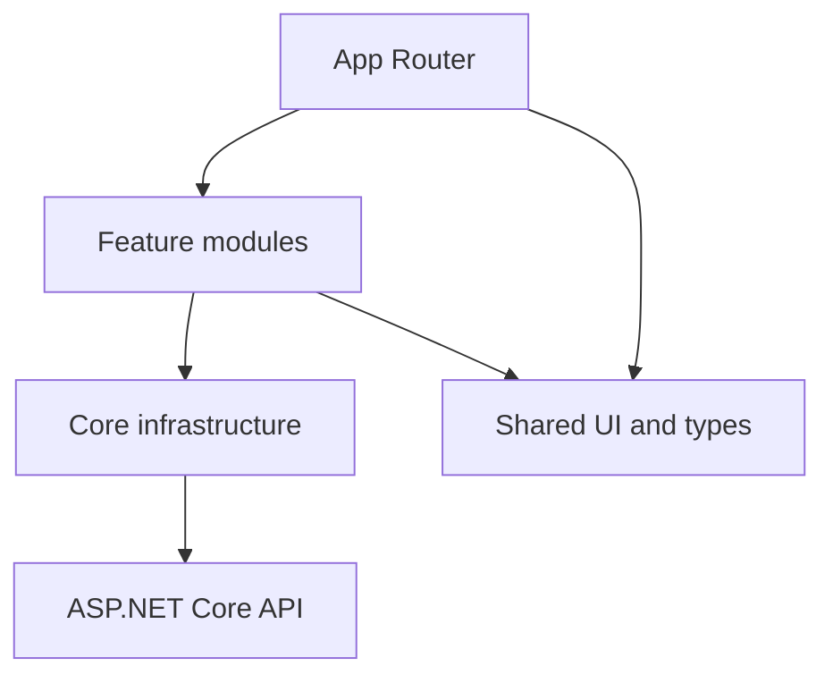
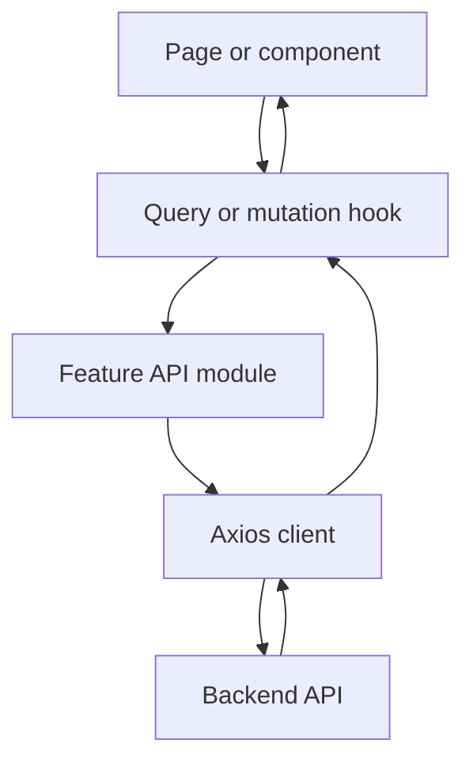
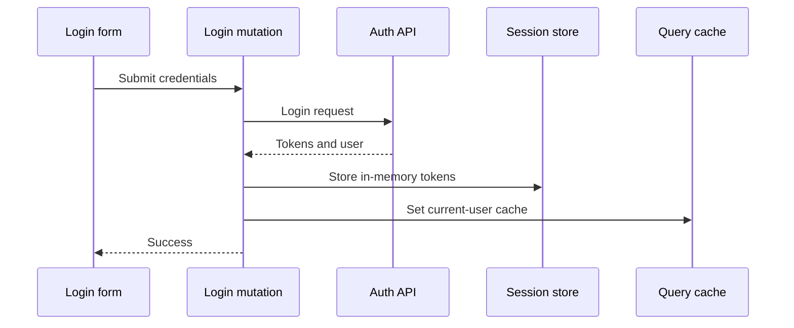
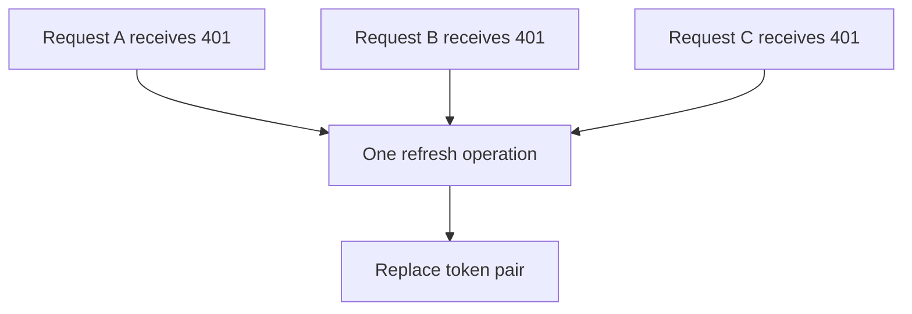

# Frontend Architecture

## 1. Purpose

This document defines the target frontend architecture for GDSC Sharing
Platform. It describes module ownership, dependency direction, API flow, state
ownership and authentication behavior.

This is an architecture specification, not an implementation file.

## 2. Architectural goals

The architecture must:

- remain understandable as the number of features grows;
- separate HTTP transport, server state, client state and rendering;
- prevent components from depending directly on Axios;
- prevent Zustand from becoming a second server-state cache;
- centralize authentication and refresh-token behavior;
- support strict TypeScript contracts;
- support cancellation, consistent error handling and testability;
- preserve Next.js Server Component boundaries where appropriate.

## 3. Technology responsibilities

| Technology         | Responsibility                                                  | Must not own                                    |
| ------------------ | --------------------------------------------------------------- | ----------------------------------------------- |
| Next.js App Router | Routing, layouts, route boundaries and server composition       | Feature API implementation                      |
| React              | Rendering and local interaction                                 | Shared server cache                             |
| Axios              | HTTP transport, headers, interceptors, timeout and cancellation | UI state and business presentation              |
| TanStack Query     | Server state, query status, cache, mutation and invalidation    | Long-lived client preferences                   |
| Zustand            | In-memory session and client-only UI state                      | API collections, query loading and server cache |

## 4. High-level dependency model



Allowed dependency direction:

```text
app → features → core
app → shared
features → shared
```

Forbidden dependency direction:

```text
core → features
shared → features
shared → application-specific core behavior
feature A → internal files of feature B
```

When one feature needs another feature, consume only that feature's documented
public export or move the genuinely shared contract into `shared/`.

## 5. Target folder structure

```text
web/
├── src/
│   ├── app/
│   │   ├── layout.tsx
│   │   ├── providers.tsx
│   │   ├── loading.tsx
│   │   ├── error.tsx
│   │   ├── page.tsx
│   │   ├── login/
│   │   └── dashboard/
│   │
│   ├── core/
│   │   ├── config/
│   │   │   └── env.ts
│   │   ├── http/
│   │   │   ├── http-client.ts
│   │   │   ├── public-http-client.ts
│   │   │   ├── refresh-coordinator.ts
│   │   │   ├── api-error.ts
│   │   │   └── problem-details.ts
│   │   ├── query/
│   │   │   ├── query-client.ts
│   │   │   └── query-provider.tsx
│   │   └── session/
│   │       ├── session.store.ts
│   │       ├── session.selectors.ts
│   │       └── session.types.ts
│   │
│   ├── features/
│   │   ├── auth/
│   │   │   ├── api/
│   │   │   ├── components/
│   │   │   ├── hooks/
│   │   │   ├── queries/
│   │   │   ├── types/
│   │   │   └── index.ts
│   │   ├── roadmaps/
│   │   ├── sharing/
│   │   └── members/
│   │
│   ├── shared/
│   │   ├── components/
│   │   │   ├── ui/
│   │   │   └── layout/
│   │   ├── hooks/
│   │   ├── constants/
│   │   └── types/
│   │
│   └── styles/
│
├── public/
├── AGENTS.md
└── ARCHITECTURE.md
```

## 6. Layer definitions

### 6.1 `app/`

Owns:

- Next.js routes and layouts;
- route composition;
- global providers;
- loading, error and not-found boundaries;
- route metadata.

Must not own:

- Axios endpoint calls;
- query-key definitions;
- reusable feature business logic;
- session refresh implementation.

### 6.2 `core/`

Owns technical infrastructure used by multiple features.

Submodules:

- `config`: validated public runtime configuration;
- `http`: Axios instances, interceptors and normalized errors;
- `query`: QueryClient and provider configuration;
- `session`: in-memory authentication session and token coordination.

`core/` must never import feature implementation files. This rule prevents the
HTTP layer from creating a circular dependency with `features/auth`.

### 6.3 `features/`

Each feature owns one business capability.

A feature may contain:

- `api`: plain asynchronous endpoint functions;
- `hooks`: feature-specific React hooks;
- `queries`: query keys and query option factories;
- `components`: feature UI;
- `types`: request, response and domain contracts;
- `index.ts`: controlled public exports.

Feature code may depend on `core/` and `shared/`.

### 6.4 `shared/`

Owns reusable elements with no business-feature dependency:

- buttons, inputs, dialogs and tables;
- layout primitives;
- generic hooks;
- broadly shared contracts and constants.

Do not move a component into `shared/` merely because it is used twice inside
one feature.

## 7. Standard API flow



Rules:

1. A component calls a feature hook.
2. The hook declares a TanStack Query query or mutation.
3. The query function calls a plain feature API function.
4. The feature API function calls the correct Axios client.
5. Axios returns data or throws a normalized `ApiError`.
6. TanStack Query owns the result, cache and request status.
7. The component renders from the hook state.

## 8. Axios architecture

### 8.1 Public client

The public Axios client is used for endpoints that do not require an access
token, such as:

```text
POST /api/auth/login
POST /api/auth/refresh
```

It owns:

- API origin;
- timeout;
- `Accept` header;
- cancellation support;
- Problem Details normalization.

It must not attach an Authorization header.

### 8.2 Authenticated client

The authenticated client is used for protected endpoints, including:

```text
GET  /api/auth/me
POST /api/auth/logout
POST /api/auth/logout-all
```

Request interceptor responsibilities:

- read the current access token from the session store;
- attach `Authorization: Bearer <token>`;
- preserve existing request headers.

Response interceptor responsibilities:

- normalize non-authentication failures;
- react only to eligible `401` responses;
- call the refresh coordinator;
- retry the original request at most once;
- stop after refresh failure.

Interceptors must not:

- show UI notifications;
- navigate the router;
- invalidate feature queries;
- interpret feature-specific business errors.

### 8.3 Content type

Do not globally force `Content-Type: application/json` for every request.

The client must allow:

- JSON requests;
- requests without bodies;
- file uploads using `FormData` and browser-generated multipart boundaries;
- file downloads.

## 9. Error model

All Axios failures are normalized into one frontend error type.

Expected fields:

| Field              | Purpose                                          |
| ------------------ | ------------------------------------------------ |
| `status`           | HTTP status when available                       |
| `title`            | Problem Details title                            |
| `message`          | Safe user-facing detail or fallback              |
| `validationErrors` | Field-to-message mapping                         |
| `traceId`          | Backend diagnostic identifier                    |
| `cause`            | Original internal error for debugging boundaries |

Handling ownership:

| Status | Owner                                          |
| -----: | ---------------------------------------------- |
|  `400` | Form or feature hook maps field errors         |
|  `401` | Refresh coordinator or authentication boundary |
|  `403` | Route/feature displays permission state        |
|  `404` | Route or feature displays not-found state      |
| `500+` | Error boundary or feature-level retry UI       |

Raw backend stack traces must never be shown to the user.

## 10. TanStack Query architecture

TanStack Query is the single owner of server state.

It manages:

- fetched entities and collections;
- loading and error status;
- request cancellation;
- cache lifetime and freshness;
- invalidation after mutations;
- bounded retry for safe reads;
- optimistic updates when rollback exists.

### 10.1 Query-key factories

Every feature defines a hierarchical query-key factory.

Conceptual examples:

```text
auth
auth/current-user

roadmaps
roadmaps/list/{filters}
roadmaps/detail/{id}

sharing
sharing/list/{filters}
sharing/detail/{id}
```

Components must not assemble query keys manually.

### 10.2 Query defaults

Recommended baseline:

| Setting                 |                                 Baseline |
| ----------------------- | ---------------------------------------: |
| Query stale time        |                               30 seconds |
| Inactive cache lifetime |                                5 minutes |
| Safe-read retry         |                          Maximum 1 retry |
| Mutation retry          |                                 Disabled |
| Refetch on window focus | Decide per feature; not globally assumed |

Authentication and highly volatile features may override these values.

### 10.3 Mutation behavior

Each mutation hook owns its business cache effects.

Examples:

- Create roadmap: invalidate the relevant roadmap lists.
- Update roadmap: update or invalidate its detail and affected lists.
- Delete roadmap: remove its detail and invalidate affected lists.
- Login: write the user into the current-user cache.
- Logout: clear private queries and session state.

Avoid invalidating the entire QueryClient when a narrow invalidation is known.

## 11. Zustand architecture

Zustand is the owner of client-only state, not server state.

### 11.1 Session store

The session store may contain:

```text
accessToken
refreshToken while the backend remains body-token based
authenticationStatus
setTokens
clearSession
```

The current user profile belongs in the TanStack Query cache and should not be
duplicated in the session store.

### 11.2 UI stores

Separate UI concerns into focused stores when global sharing is required:

```text
layout.store
theme.store
modal.store
```

Do not create one application-wide store containing authentication, filters,
entities, forms and layout state.

### 11.3 Selector usage

Components subscribe through selectors so a component does not rerender for
unrelated store fields.

## 12. Authentication lifecycle

### 12.1 Login



Password values must not be trimmed or logged.

### 12.2 Authenticated request

```text
Feature query
→ authenticated Axios client
→ request interceptor reads access token
→ backend
```

### 12.3 Refresh-token rotation

The backend treats refresh tokens as rotating and single-use. Therefore all
concurrent refresh attempts must share one in-flight promise.



After refresh succeeds:

1. replace both tokens atomically in the session store;
2. discard the old refresh token immediately;
3. replay queued requests once with the new access token.

After refresh fails:

1. clear the session once;
2. reject queued requests;
3. clear private query data;
4. allow the authentication boundary to send the user to login;
5. do not start another refresh loop.

### 12.4 Logout

Logout should:

1. send the current refresh token to the logout endpoint when required by the
   current backend contract;
2. clear the local session even when the remote logout is already idempotently
   completed;
3. remove private QueryClient data;
4. redirect through the route/authentication layer, not an Axios interceptor.

### 12.5 Logout all

After logout-all succeeds:

- clear session tokens;
- remove every private cached query;
- treat the current access token as invalid;
- return the user to login.

## 13. Token storage decision

Preferred production model:

| Token         | Storage                         |
| ------------- | ------------------------------- |
| Access token  | Zustand memory                  |
| Refresh token | Secure HttpOnly SameSite cookie |
| Current user  | TanStack Query cache            |

Current body-token compatibility model:

| Token         | Storage             |
| ------------- | ------------------- |
| Access token  | Zustand memory      |
| Refresh token | Zustand memory only |

Do not use Zustand persistence middleware for refresh tokens.

The compatibility model means a full browser refresh loses the session. If
persistent login is required, the backend contract should move refresh tokens
to HttpOnly cookies instead of weakening browser storage security.

## 14. Provider composition

The root client provider owns long-lived client infrastructure:

```text
AppProviders
└── QueryClientProvider
    └── future cross-cutting providers when approved
```

The QueryClient must be created once per browser application lifecycle, not on
every render.

Do not add feature-specific providers to the root unless the feature genuinely
requires application-wide context.

## 15. Next.js rendering strategy

- Prefer Server Components for static and public composition.
- Use Client Components for TanStack Query hooks, Zustand subscriptions, forms
  and browser interaction.
- Keep the provider boundary narrow but high enough for authenticated features.
- Do not convert the complete route tree into Client Components solely because
  one child uses TanStack Query.
- Protected server rendering requires an HttpOnly-cookie authentication model.
  With memory-only tokens, protected data is loaded after client authentication
  becomes known.
- TanStack Query server prefetch and hydration may be added for public or
  cookie-authenticated data when needed.

## 16. Environment contract

`NEXT_PUBLIC_API_URL` contains the public API origin only.

Example conceptual value:

```text
http://localhost:5080
```

Feature API modules append real endpoint paths such as `/api/auth/login`.

Do not set the base URL to `/api/v1` unless the backend routes are actually
versioned below that prefix. In the current backend, `/api/v1` is an API status
endpoint while authentication is rooted at `/api/auth`.

No password, JWT secret, refresh token or private infrastructure credential may
use a `NEXT_PUBLIC_*` variable.

## 17. Feature template

Every business feature follows this conceptual structure:

```text
feature-name/
├── api/
│   └── feature-name.api.ts
├── components/
├── hooks/
│   ├── use-feature-list-query.ts
│   └── use-create-feature-mutation.ts
├── queries/
│   └── feature-name.keys.ts
├── types/
│   └── feature-name.types.ts
└── index.ts
```

Public components consume hooks. Hooks consume API functions. API functions
consume Axios clients.

## 18. Naming conventions

- Files and folders: `kebab-case`.
- React components: `PascalCase`.
- Hooks: `useXxxQuery`, `useXxxMutation` or `useXxx`.
- API modules: `feature.api.ts`.
- Query keys: `feature.keys.ts`.
- Zustand stores: `concern.store.ts`.
- Request types: `XxxRequest`.
- Response types: `XxxResponse`.
- Domain view types: business names such as `Roadmap`, `Member` or
  `SharingSession`.

Avoid generic files such as `utils.ts`, `helpers.ts`, `service.ts` and
`types.ts` when their ownership is unclear.

## 19. Testing architecture

Recommended test ownership:

| Layer          | Test focus                                                     |
| -------------- | -------------------------------------------------------------- |
| Core HTTP      | Error normalization, header behavior and refresh coordination  |
| Query hooks    | Query keys, cache effects, invalidation and errors             |
| Zustand stores | State transitions and selector behavior                        |
| Components     | User interaction and accessibility                             |
| E2E            | Login, refresh, logout, logout-all and role-protected journeys |

Mock the network boundary rather than mocking internal feature hooks in most
component tests.

Critical refresh tests must include:

- one `401` refreshes and replays once;
- several simultaneous `401` responses trigger one refresh request;
- refresh failure clears the session;
- a replayed request receiving another `401` is not refreshed again;
- logout clears private QueryClient data.

## 20. Architecture decisions summary

| Decision                           | Reason                                                               |
| ---------------------------------- | -------------------------------------------------------------------- |
| Feature-based modules              | Keeps business ownership clear as the project grows                  |
| Axios only in API/core layers      | Prevents transport details leaking into UI                           |
| TanStack Query owns server state   | Avoids custom cache and duplicated loading logic                     |
| Zustand owns client state only     | Prevents two competing server-state stores                           |
| Session store placed in `core`     | Allows Axios to access tokens without importing auth feature code    |
| Current user stored in Query cache | User profile is server-owned data                                    |
| Two Axios clients                  | Separates public refresh/login calls from authenticated interception |
| Single-flight refresh              | Prevents rotating refresh-token reuse detection                      |
| Feature query-key factories        | Makes invalidation predictable and type-safe                         |
| HttpOnly refresh cookie preferred  | Reduces token exposure to browser JavaScript                         |

## 21. Architecture change policy

Update this document when a change affects:

- top-level folders or layers;
- dependency direction;
- Axios client behavior;
- session or token storage;
- QueryClient defaults;
- query-key conventions;
- state ownership between TanStack Query and Zustand;
- authentication refresh behavior;
- provider composition;
- Server Component or hydration strategy.

Small feature implementation details that preserve these boundaries do not
require an architecture-document update.
