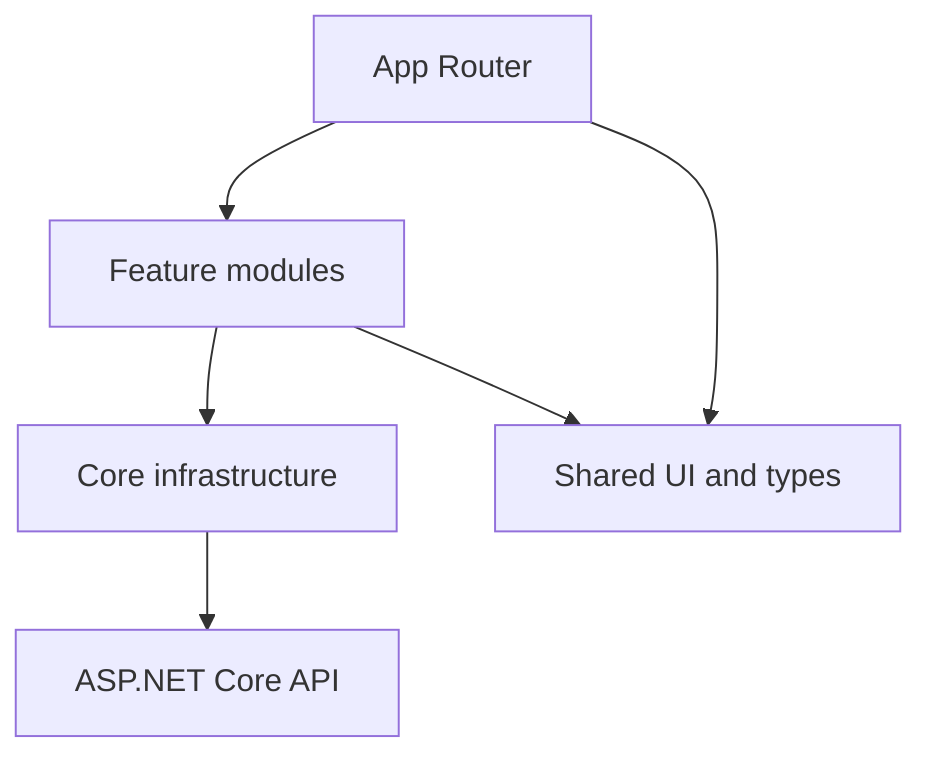
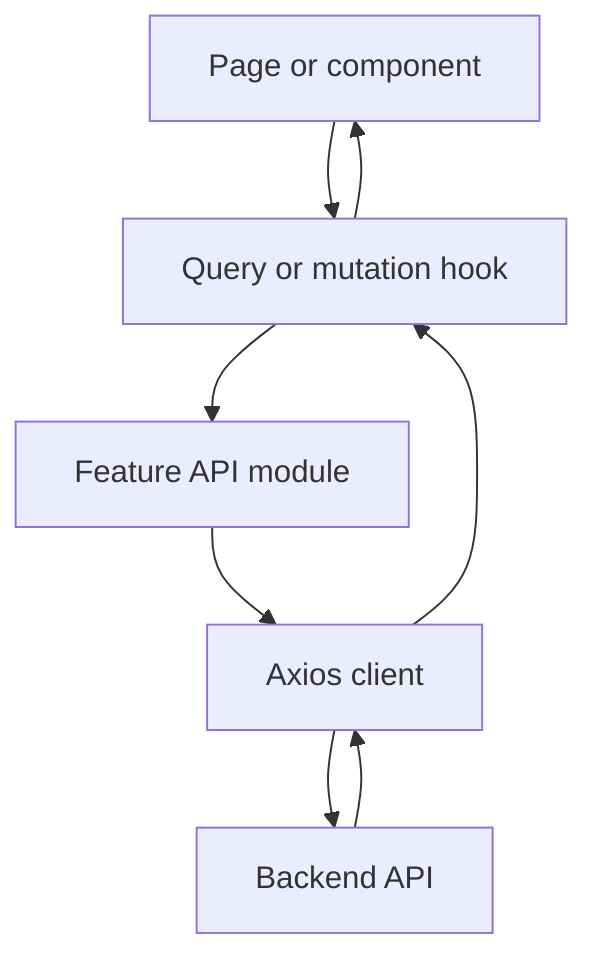

# Frontend Architecture

## 1. Purpose

This document defines the target frontend architecture for GDSC Sharing
Platform. It describes module ownership, dependency direction, API flow, state
ownership and authentication behavior.

This is an architecture specification. The current browser authentication contract is the Phase 4 BFF model below; historical token-in-memory examples are not used by this implementation.

## 2. Architectural goals

The architecture must:

- remain understandable as the number of features grows;
- separate HTTP transport, server state, client state and rendering;
- prevent components from depending directly on Axios;
- prevent Zustand from becoming a second server-state cache;
- centralize authentication and refresh-token behavior;
- support strict TypeScript contracts;
- support cancellation, consistent error handling and testability;
- preserve Next.js Server Component boundaries where appropriate.

## 3. Technology responsibilities

| Technology         | Responsibility                                                  | Must not own                                    |
| ------------------ | --------------------------------------------------------------- | ----------------------------------------------- |
| Next.js App Router | Routing, layouts, route boundaries and server composition       | Feature API implementation                      |
| React              | Rendering and local interaction                                 | Shared server cache                             |
| Axios              | HTTP transport, headers, interceptors, timeout and cancellation | UI state and business presentation              |
| TanStack Query     | Server state, query status, cache, mutation and invalidation    | Long-lived client preferences                   |
| Zustand            | In-memory session and client-only UI state                      | API collections, query loading and server cache |

## 4. High-level dependency model



Allowed dependency direction:

```text
app → features → core
app → shared
features → shared
```

Forbidden dependency direction:

```text
core → features
shared → features
shared → application-specific core behavior
feature A → internal files of feature B
```

When one feature needs another feature, consume only that feature's documented
public export or move the genuinely shared contract into `shared/`.

## 5. Target folder structure

```text
web/
├── src/
│   ├── app/
│   │   ├── layout.tsx
│   │   ├── providers.tsx
│   │   ├── loading.tsx
│   │   ├── error.tsx
│   │   ├── page.tsx
│   │   ├── login/
│   │   └── dashboard/
│   │
│   ├── core/
│   │   ├── config/
│   │   │   └── env.ts
│   │   ├── http/
│   │   │   ├── http-client.ts
│   │   │   ├── public-http-client.ts
│   │   │   ├── refresh-coordinator.ts
│   │   │   ├── api-error.ts
│   │   │   └── problem-details.ts
│   │   ├── query/
│   │   │   ├── query-client.ts
│   │   │   └── query-provider.tsx
│   │   └── session/
│   │       ├── session.store.ts
│   │       ├── session.selectors.ts
│   │       └── session.types.ts
│   │
│   ├── features/
│   │   ├── auth/
│   │   │   ├── api/
│   │   │   ├── components/
│   │   │   ├── hooks/
│   │   │   ├── queries/
│   │   │   ├── types/
│   │   │   └── index.ts
│   │   ├── roadmaps/
│   │   ├── sharing/
│   │   └── members/
│   │
│   ├── shared/
│   │   ├── components/
│   │   │   ├── ui/
│   │   │   └── layout/
│   │   ├── hooks/
│   │   ├── constants/
│   │   └── types/
│   │
│   └── styles/
│
├── public/
├── AGENTS.md
└── ARCHITECTURE.md
```

## 6. Layer definitions

### 6.1 `app/`

Owns:

- Next.js routes and layouts;
- route composition;
- global providers;
- loading, error and not-found boundaries;
- route metadata.

Must not own:

- Axios endpoint calls;
- query-key definitions;
- reusable feature business logic;
- session refresh implementation.

### 6.2 `core/`

Owns technical infrastructure used by multiple features.

Submodules:

- `config`: validated public runtime configuration;
- `http`: Axios instances, interceptors and normalized errors;
- `query`: QueryClient and provider configuration;
- `session`: in-memory authentication session and token coordination.

`core/` must never import feature implementation files. This rule prevents the
HTTP layer from creating a circular dependency with `features/auth`.

### 6.3 `features/`

Each feature owns one business capability.

A feature may contain:

- `api`: plain asynchronous endpoint functions;
- `hooks`: feature-specific React hooks;
- `queries`: query keys and query option factories;
- `components`: feature UI;
- `types`: request, response and domain contracts;
- `index.ts`: controlled public exports.

Feature code may depend on `core/` and `shared/`.

### 6.4 `shared/`

Owns reusable elements with no business-feature dependency:

- buttons, inputs, dialogs and tables;
- layout primitives;
- generic hooks;
- broadly shared contracts and constants.

Do not move a component into `shared/` merely because it is used twice inside
one feature.

## 7. Standard API flow



Rules:

1. A component calls a feature hook.
2. The hook declares a TanStack Query query or mutation.
3. The query function calls a plain feature API function.
4. The feature API function calls the correct Axios client.
5. Axios returns data or throws a normalized `ApiError`.
6. TanStack Query owns the result, cache and request status.
7. The component renders from the hook state.

## 8. Axios architecture

### 8.1 Public client

The public Axios client is used for endpoints that do not require an access
token, such as:

```text
POST /api/auth/login
POST /api/auth/refresh
```

It owns:

- API origin;
- timeout;
- `Accept` header;
- cancellation support;
- Problem Details normalization.

It must not attach an Authorization header.

### 8.2 Authenticated client

The authenticated client is used for protected endpoints, including:

```text
GET  /api/auth/me
POST /api/auth/logout
POST /api/auth/logout-all
```

Browser API calls use same-origin BFF routes. JavaScript never reads or attaches
tokens. Next.js reads HttpOnly cookies and forwards a Bearer header to the API.
A response interceptor refreshes on an eligible 401 and retries once. The client
uses a single-flight promise and Web Locks across tabs where available; inside
the lock it rechecks /me before rotating. A 403 from a business endpoint does not
trigger refresh. Session revision checks prevent old requests invalidating a new login.

Interceptors must not:

- show UI notifications;
- navigate the router;
- invalidate feature queries;
- interpret feature-specific business errors.

### 8.3 Content type

Do not globally force `Content-Type: application/json` for every request.

The client must allow:

- JSON requests;
- requests without bodies;
- file uploads using `FormData` and browser-generated multipart boundaries;
- file downloads.

## 9. Error model

All Axios failures are normalized into one frontend error type.

Expected fields:

| Field              | Purpose                                          |
| ------------------ | ------------------------------------------------ |
| `status`           | HTTP status when available                       |
| `title`            | Problem Details title                            |
| `message`          | Safe user-facing detail or fallback              |
| `validationErrors` | Field-to-message mapping                         |
| `traceId`          | Backend diagnostic identifier                    |
| `cause`            | Original internal error for debugging boundaries |

Handling ownership:

| Status | Owner                                          |
| -----: | ---------------------------------------------- |
|  `400` | Form or feature hook maps field errors         |
|  `401` | Refresh coordinator or authentication boundary |
|  `403` | Route/feature displays permission state        |
|  `404` | Route or feature displays not-found state      |
| `500+` | Error boundary or feature-level retry UI       |

Raw backend stack traces must never be shown to the user.

## 10. TanStack Query architecture

TanStack Query is the single owner of server state.

It manages:

- fetched entities and collections;
- loading and error status;
- request cancellation;
- cache lifetime and freshness;
- invalidation after mutations;
- bounded retry for safe reads;
- optimistic updates when rollback exists.

### 10.1 Query-key factories

Every feature defines a hierarchical query-key factory.

Conceptual examples:

```text
auth
auth/current-user

roadmaps
roadmaps/list/{filters}
roadmaps/detail/{id}

sharing
sharing/list/{filters}
sharing/detail/{id}
```

Components must not assemble query keys manually.

### 10.2 Query defaults

Recommended baseline:

| Setting                 |                                 Baseline |
| ----------------------- | ---------------------------------------: |
| Query stale time        |                               30 seconds |
| Inactive cache lifetime |                                5 minutes |
| Safe-read retry         |                          Maximum 1 retry |
| Mutation retry          |                                 Disabled |
| Refetch on window focus | Decide per feature; not globally assumed |

Authentication and highly volatile features may override these values.

### 10.3 Mutation behavior

Each mutation hook owns its business cache effects.

Examples:

- Create roadmap: invalidate the relevant roadmap lists.
- Update roadmap: update or invalidate its detail and affected lists.
- Delete roadmap: remove its detail and invalidate affected lists.
- Login: write the user into the current-user cache.
- Logout: clear private queries and session state.

Avoid invalidating the entire QueryClient when a narrow invalidation is known.

## 11. Zustand architecture

Zustand is the owner of client-only state, not server state.

### 11.1 Session store

The session store contains only authentication status, a session revision,
and a public user-profile mirror for existing UX selectors. The authoritative
profile is loaded from /api/auth/me and cached by TanStack Query. No tokens,
browser-cookie helpers or localStorage persistence are permitted. Session loss
from any API clears private query state through SessionBoundary.

## 12. Authentication lifecycle

1. Password login goes through the BFF, which writes token cookies and returns
   only the validated public profile. The client hydrates using /api/auth/me.
2. Google start creates an HttpOnly verifier cookie and sends its SHA256 challenge
   to the backend. Google OIDC callback remains owned by ASP.NET Core.
3. After OIDC validation the API creates an internal session and a 60-second,
   single-use handoff code bound to that challenge. Next.js exchanges code plus
   verifier over the server channel, writes token cookies, deletes temporary
   cookies and redirects to a validated local path.
4. Only the BFF refresh route rotates tokens and persists both new cookies.
   Middleware and Server Components never rotate or serialize tokens.
5. Rejected refresh or failed callback clears cookies. A temporary refresh
   outage does not erase the session. Browser state/cache is cleared on session loss.
6. Logout clears local cookies even if backend revocation is unreachable.
   Logout-all reports backend failure instead of pretending all devices were revoked.

The API handoff store and BFF refresh map are process-local. Multiple replicas,
serverless instances, and durable exchange across restarts require shared atomic
storage/coordination before deployment. Web Locks are an additional browser-side
safeguard, not a replacement for shared server coordination.

## 13. Token storage decision

Both GDSC access and refresh tokens live exclusively in HttpOnly, SameSite=Lax,
host-only cookies; Secure is enabled in production. Google provider tokens are
not persisted. No token enters browser JSON responses, Zustand, localStorage,
redirect URLs or React Server Component props. The internal handoff code is not
a provider authorization code or access token and requires the verifier cookie.

State-changing BFF routes validate the exact canonical Origin. The generic proxy
accepts only known business route roots, rejects ambiguous encoded paths, and
does not forward auth endpoints or upstream Set-Cookie headers. API authorization
remains mandatory; client guards and middleware are UX aids only.

Browser API requests always use same-origin BFF routes, regardless of
NEXT_PUBLIC_API_URL. Server-only configuration:

- APP_ORIGIN: canonical frontend origin for redirects and mutation Origin checks.
- BACKEND_PUBLIC_ORIGIN: HTTPS backend origin used by browser OIDC navigation,
  including local development (Secure correlation/nonce cookies).
- INTERNAL_API_URL: backend server channel; BACKEND_API_URL is its fallback and
  also serves public uploads.
- Authentication:Google:BffCallbackUrl (backend): exact Next.js handoff callback.

Production origins require HTTPS. Do not expose Google credentials or internal
tokens through NEXT_PUBLIC_* variables. See .env.example and the root README.

.
