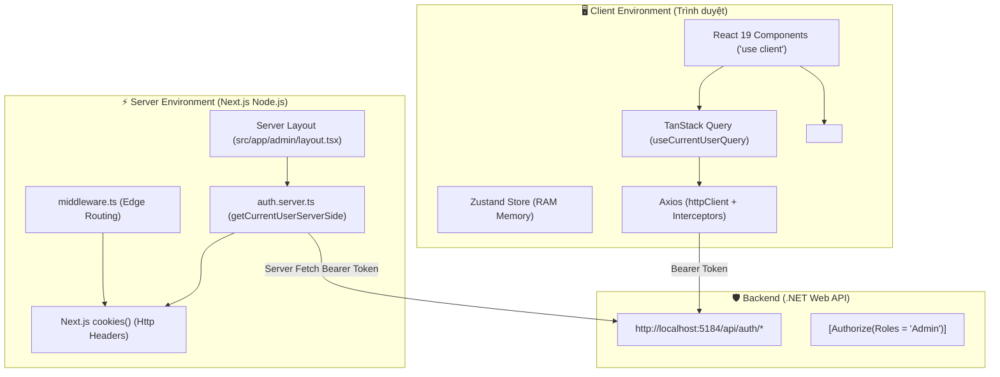
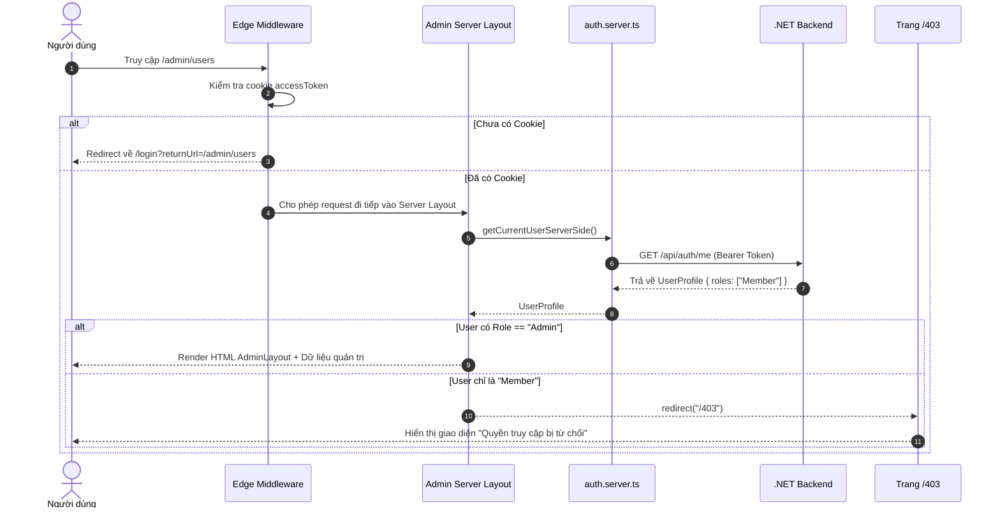

# Báo Cáo & Tài Liệu Review: Kiến Trúc Authentication & Phân Quyền (RBAC)

> **Dự án**: GDSC Sharing Platform  
> **Ngày thực hiện**: Tháng 09/2026  
> **Tài liệu**: `frontend/docs/review/auth.review.md`

---

## 1. Tổng Quan Kiến Trúc (Architecture Overview)

Hệ thống xác thực (**Authentication**) và phân quyền (**Authorization / RBAC**) của nền tảng GDSC được thiết kế theo mô hình **Đa tầng phòng thủ (Defense in Depth)**, phân định rạch ròi giữa môi trường **Client-Side (Trình duyệt)** và **Server-Side (Node.js/Next.js App Router)**.



---

## 2. Chi Tiết Việc Tách Biệt 2 API (Client API vs Server API)

Thay vì viết gộp chung gây rò rỉ mã hoặc phụ thuộc runtime phức tạp, hệ thống đã được tái cấu trúc thành **2 module độc lập**:

### A. Client API: `src/features/auth/api/auth.api.ts`

- **Môi trường chạy**: Trình duyệt người dùng (Client-Side).
- **Công nghệ**: Axios `httpClient`, đính kèm `Authorization: Bearer <accessToken>` từ Zustand RAM Store.
- **Cơ chế tự phục hồi (Silent Refresh Token)**: Khi Access Token hết hạn (Backend trả về mã `401 Unauthorized`), Axios Interceptor tự động kích hoạt tiến trình lấy cặp Token mới và gửi lại request ban đầu trong suốt (người dùng không bị văng ra màn hình đăng nhập).
- **Các hàm export**:
  - `loginApi(request)`: Gửi thông tin đăng nhập.
  - `getCurrentUserApi(signal)`: Lấy thông tin User Profile cho Client.
  - `logoutApi(request)`: Đăng xuất phiên hiện tại.
  - `logoutAllApi()`: Đăng xuất toàn bộ các thiết bị.

### B. Server API: `src/features/auth/api/auth.server.ts`

- **Môi trường chạy**: Node.js Server (Next.js Server Components, Server Actions, Server Layouts).
- **Công nghệ**: Đọc trực tiếp Cookie `accessToken` từ `next/headers` và gọi Backend qua native `fetch` (`cache: 'no-store'`).
- **Đặc tính an toàn**:
  - Không phụ thuộc vào `window` hay `document`.
  - Không bao giờ bị lộ code logic hoặc biến môi trường nhạy cảm ra ngoài trình duyệt.
- **Các hàm export**:
  - `getCurrentUserServerSide(token?)`: Lấy thông tin User Profile trực tiếp trên máy chủ.
  - `hasRoleServerSide(role)`: Kiểm tra vai trò của người dùng trên Server.
  - `isAdminServerSide()`: Kiểm tra nhanh quyền Admin trên Server.
  - `decodeJwtPayload(token)`: Giải mã payload JWT nhanh chóng không cần gọi network.

---

## 3. Hệ Thống Phân Quyền Admin & Member (RBAC Matrix)

| Cấp độ                         | Vị trí thực thi | File đảm nhiệm                      | Nhiệm vụ chính                                                                                   |
| :----------------------------- | :-------------- | :---------------------------------- | :----------------------------------------------------------------------------------------------- |
| **Cấp 1: Server Layout Guard** | Server (SSR)    | `src/app/admin/layout.tsx`          | Kiểm tra quyền Admin trước khi sinh HTML. Nếu không phải Admin $\rightarrow$ `redirect('/403')`. |
| **Cấp 2: Edge Middleware**     | Edge Network    | `src/middleware.ts`                 | Chặn các request chưa có Token tới các route được bảo vệ (`/admin`, `/dashboard`, `/schedule`).  |
| **Cấp 3: Client Role Guard**   | Browser (UI)    | `src/components/auth/RoleGuard.tsx` | Ẩn/hiện có điều kiện các nút bấm, menu quản trị, hành động nhạy cảm trên giao diện.              |
| **Cấp 4: Trang 403 Forbidden** | Client/Server   | `src/app/403/page.tsx`              | Giao diện thông báo từ chối truy cập chuẩn nhận diện thương hiệu GDSC.                           |
| **Cấp 5: Backend API Guard**   | .NET Controller | Backend Controllers                 | Áp dụng `[Authorize(Roles = "Admin")]` để bảo vệ dữ liệu ở mức Database.                         |

---

## 4. Quy Trình Hoạt Động Chi Tiết (Step-by-step Flows)

### Flow 1: Người dùng truy cập trang Quản trị (`/admin/*`)



---

### Flow 2: Ẩn/Hiện thành phần giao diện trên Client (`RoleGuard`)

```tsx
// Ví dụ thực tế trong component
import { RoleGuard } from "@/components/auth/RoleGuard";
export function UserActionButtons() {
  return (
    <div className="flex gap-2">
      {/* Mọi Member đều thấy nút Xem */}
      <Button variant="outline">Xem chi tiết</Button>
      {/* Chỉ Admin mới thấy nút Xóa và Sửa */}
      <RoleGuard allowedRoles={["Admin"]}>
        <Button variant="destructive">Xóa tài khoản</Button>
      </RoleGuard>
    </div>
  );
}
```

---

## 5. Danh Sách Các File Code Đã Viết / Chỉnh Sửa

| Đường dẫn File                                                                                                                                                   | Loại        | Mô tả chi tiết                                                                                        |
| :--------------------------------------------------------------------------------------------------------------------------------------------------------------- | :---------- | :---------------------------------------------------------------------------------------------------- |
| [`frontend/src/features/auth/api/auth.api.ts`](file:///Users/nguyenhongson/Documents/GDG/gdsc-sharing-platform/frontend/src/features/auth/api/auth.api.ts)       | Client API  | Chứa `loginApi`, `getCurrentUserApi`, `logoutApi` thuần Client (Axios + Interceptors).                |
| [`frontend/src/features/auth/api/auth.server.ts`](file:///Users/nguyenhongson/Documents/GDG/gdsc-sharing-platform/frontend/src/features/auth/api/auth.server.ts) | Server API  | Chứa `getCurrentUserServerSide`, `hasRoleServerSide`, `isAdminServerSide` thuần Server (`cookies()`). |
| [`frontend/src/features/auth/utils/rbac.ts`](file:///Users/nguyenhongson/Documents/GDG/gdsc-sharing-platform/frontend/src/features/auth/utils/rbac.ts)           | Tiện ích    | Các hàm helper kiểm tra vai trò: `hasRole`, `hasAnyRole`, `isAdmin`, `isMember`.                      |
| [`frontend/src/components/auth/RoleGuard.tsx`](file:///Users/nguyenhongson/Documents/GDG/gdsc-sharing-platform/frontend/src/components/auth/RoleGuard.tsx)       | Component   | Component bọc UI điều kiện theo danh sách Role được cấp phép.                                         |
| [`frontend/src/app/admin/layout.tsx`](file:///Users/nguyenhongson/Documents/GDG/gdsc-sharing-platform/frontend/src/app/admin/layout.tsx)                         | Layout      | Server Component bảo vệ phân vùng `/admin`, kiểm tra role Admin trên máy chủ.                         |
| [`frontend/src/app/403/page.tsx`](file:///Users/nguyenhongson/Documents/GDG/gdsc-sharing-platform/frontend/src/app/403/page.tsx)                                 | Page        | Trang lỗi 403 Access Denied với nút quay lại và về trang chủ.                                         |
| [`frontend/src/features/auth/index.ts`](file:///Users/nguyenhongson/Documents/GDG/gdsc-sharing-platform/frontend/src/features/auth/index.ts)                     | Entry Point | Re-export toàn bộ types, apis, hooks, utils của feature Auth.                                         |

---

## 6. Hướng Dẫn Sử Dụng Nhanh (Code Recipes)

### 1. Dùng trong Server Component (Trang Server, Layout Server):

```tsx
import { getCurrentUserServerSide, isAdminServerSide } from "@/features/auth";
export default async function MyServerPage() {
  const user = await getCurrentUserServerSide();
  const isAdmin = await isAdminServerSide();
  return (
    <div>
      Xin chào, {user?.displayName} (Admin: {String(isAdmin)})
    </div>
  );
}
```

### 2. Dùng trong Client Component (Trang Client, Hook):

```tsx
"use client";
import { useCurrentUserQuery, isAdmin } from "@/features/auth";
export function MyClientComponent() {
  const { data: user, isLoading } = useCurrentUserQuery();
  if (isLoading) return <div>Đang tải...</div>;
  return (
    <div>
      <p>Người dùng: {user?.displayName}</p>
      {isAdmin(user) && <span className="badge">Quản trị viên</span>}
    </div>
  );
}
```

---

## 7. Kiểm Tra & Đánh Giá Chất Lượng

- **Lint Check (`eslint .`)**: ✅ **0 Errors, 0 Warnings**.
- **Format Check (`prettier`)**: ✅ **100% Files Clean**.
- **Tính tương thích**: Hoàn toàn tương thích với **Next.js 16/15, React 19, TypeScript 5, Tailwind CSS v4**.
